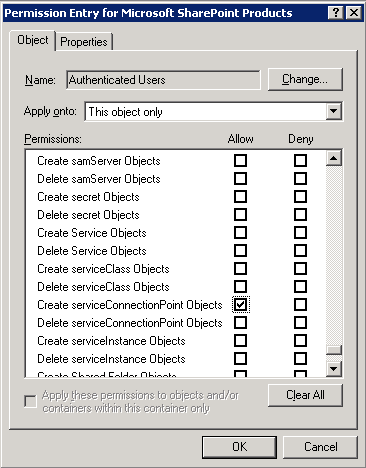
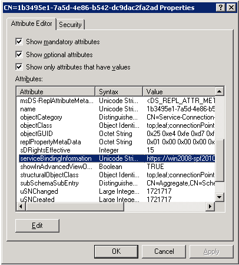

A few days ago Jie Li [posted instructions](http://blogs.msdn.com/opal/archive/2010/04/18/track-sharepoint-2010-installations-by-service-connection-point-ad-marker.aspx) on how to track SharePoint 2010 installations in an organization by using AD Service Connection points. This sounded really promising, as it could (for example) allow admins to track 'rogue' SharePoint installs, or at a minimum just be able to quickly determine where SharePoint's been installed.

However, I (for one) could not get the GUID sub-container that Jie mentions in his article to be created. I initially thought the problem was that I wasn't actually using PSConfig (or PSConfigUI), but rather PowerShell commands (through my [AutoSPInstaller](http://autospinstaller.codeplex.com) process). So I ran some tests using SharePoint Foundation (for speed & simplicity) via the GUI, and got some disappointing results:

- Using the instructions exactly as outlined in the article, no service connection point got created
- An error was logged in the Application log of the SharePoint server, stating that it had a problem with the ContainerDistinguishedName (as we were instructed to create it in the registry)

Fair enough, I thought. Guided by the error in the event log (which I should have captured for this post - my bad), I then changed the ContainerDistinguishedName value in the registry to something that actually _looked_ like a DistinguishedName:

> **CN=Microsoft SharePoint Products,CN=System**

\[caption id="attachment\_63" align="aligncenter" width="500" caption="Click to enlarge"\][![[click to enlarge]](images/containerdistinguishedname.png)](http://spinsiders.com/brianlala/files/2010/04/containerdistinguishedname.png)\[/caption\]Now, I began to get different errors on subsequent PSConfig attempts - along the lines of "General access denied". I correlated these to failure audit events on the domain controller, which indicated that, contrary to Jie's instructions, _Write_ permissions to the **Microsoft SharePoint Products** container wasn't enough; we needed something more...

Long story short, it appears that you don't even _need_ Write permission to the container; it's sufficient (but necessary) to have the "Create serviceConnectionPoint Objects" permissions (defined on the container object only):

As you can see I've gone ahead and granted **Authenticated Users** the required privileges. Why? Because in order for this feature to be useful (and track as many SharePoint installs as possible), we need installations performed by _anyone_ with a domain account (not just super-users) to register themselves in AD. Further, the super-granular permissions "Create serviceConnectionPoint Objects" (instead of full Write, as initially thought) should mitigate any risk of granting such broad access.

Once I performed these few steps, I ran the SharePoint Products and Technologies Configuration Wizard, and when it finished I could see the new Service Connection Point in Active Directory:

And finally, back to the question about PSConfig being required for all this to work (as opposed to Powershell cmdlets): it appears that yes, only PSConfig does the trick. There's still something 'missing' in the series of Powershell cmdlets that serve to emulate the PSConfig-like activities. Not sure why but stay tuned.

Hope this helps anyone who's run into similar issues.

Brian
