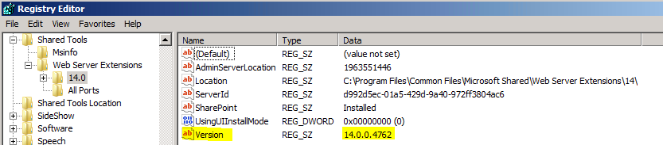

 

As first pointed out in a discussion on my [AutoSPInstaller discussion area](http://autospinstaller.codeplex.com/Thread/View.aspx?ThreadId=216421) on Codeplex, and seemingly confirmed in at least one [post](http://www.networkfoo.org/server-infrastructure/microsoft/sharepoint/sharepoint-2010-issue-backing-dpm-2010) (that I could find so far), there appears to be an issue with one of the Powershell cmdlets that, when run with a series of other cmdlets, is the equivalent of the SharePoint Products and Technologies Configuration Wizard (AKA psconfigui.exe). The problem can be summed up as follows:

In a regular GUI-based manual installation and configuration, a registry string value called **Version** gets created at:

**HKLM:SOFTWAREMicrosoftShared ToolsWeb Server Extensions14.0**

\[caption id="attachment\_93" align="alignnone" width="300" caption="Click to enlarge"\]\[/caption\]

However, if you use the SharePoint 2010 Powershell cmdlets (not sure about legacy stsadm-based configs though), the **Version** string doesn't get created for some reason! This causes problems with at least one product - Data Protection Manager 2010 (see links above to relevant posts) - as well as some confusion not only as to why this would happen, but what _other_ issues this missing registry entry might cause.

In the meantime, and to set things straight for now, I'm considering just setting the missing registry string value (currently **14.0.0.4762** for the RTM build) by adding a _New-ItemProperty_ command in the [AutoSPInstaller](http://autospinstaller.codeplex.com/). However I'm left feeling that this is kinda less than ideal...

Can anyone else confirm this issue? Have you found any fixes, or are you just using a workaround like the one I've suggested?

Cheers Brian
