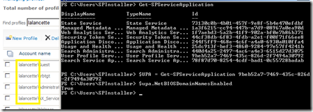
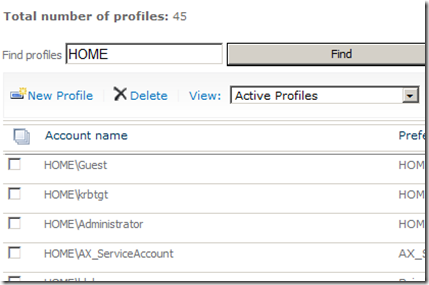

With the release of Service Pack 1 for SharePoint 2010 came a cmdlet called Add-SPProfileSyncConnection which finally allowed the OOB creation of a User Profile Sync connection with Powershell. Prior to this, one would either have to resort to manual creation of a User Profile Sync connection or write up some fairly eloquent custom Powershell to do the job.

As great as Add-SPProfileSyncConnection promised to be, there were some [limitations](http://www.harbar.net/archive/2011/07/12/332.aspx) discovered and not much documentation around it. Further, I think I may have found another issue with this new cmdlet – but it only applies in specific cases.

The User Profile service application has a property called NetBIOSDomainNamesEnabled, which is by default set to _False_. It can be set to _True_ though if the host portion of your Active Directory domain name (e.g. _corporate_.local) doesn’t match the NetBIOS name of your domain (e.g. _CORP_). Otherwise, imported user profiles will incorrectly appear in the format _corporate_\\brianl instead of the actual value _CORP_\\brianl.

I’ve noticed that, on a User Profile service app with NetBIOSDomainNamesEnabled set to _True_, if a sync connection is created using Add-SPProfileSyncConnection and users are subsequently imported, the username format comes through incorrecty - as though NetBIOSDomainNamesEnabled was still set to _False_.

In the example below, you can see how, in my test domain _lalancette.home_, with NetBIOSDomainNamesEnabled set to True, my user profiles show up incorrectly as _lalancette_\\username:

As this is unacceptable and just plain wrong, I decide to blow away the sync connection that was created by the cmdlet, and create one manually, old skool style – with identical parameters (as far as I can control). The connection gets created successfully (confession: I still get a little giddy when this happens), and I then proceed to _Start Full Synchronization_ from Central Admin.

Monitoring user profiles within the service app page, I can actually see the number of profiles _drop_ down to zero after that first full sync. No problem... I run it again, and presto… my user profiles return, and – most importantly – they display in the correct format! 

I’ve run this through several times, and can only attribute it to the connection having been created with the Add-SPProfileSyncConnection cmdlet.

Finally, I’ve confirmed this in all types of post-SP1 farms: SP1 alone, SP1 with the June 2011 CU, and even SP1 with the August 2011 CU.

Has anyone else run into this? Ping me on Twitter: **@brianlala**

Cheers
