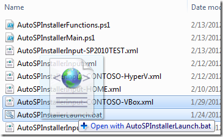

Well it’s been a little while since the last [AutoSPInstaller release](http://autospinstaller.codeplex.com/releases/view/38568?ProjectName=autospinstaller) (and the last blog post, to be honest) but let me assure you it’s been all work and (slightly less) play! The last few months have seen a pretty intense development crunch for the automated SharePoint 2010 install/config script, and I just can’t seem to figure out when to call it quits and stop scope-creeping myself. Anyhow I think it’s time I came up for air to let everyone know what I’ve been up to.

### More Of The Same Goodness, Tweaked

While there’s some notable new features (see below), one of the goals of a new release should obviously be to resolve some outstanding issues. So I managed to fit a bunch of fixes in, and here are some of them in no particular order...

First, the CreateEnterpriseSearchServiceApp function seems to have never been able to successfully have more than one query server and successfully create the query topology (for reasons that turned out to be pretty odd.) Expect a fix for that in v3.

Also, the ValidatePassphrase function will now actually check farm passphrases against _all_ criteria (previously, the requirement for an 8-character minimum was missing).

A nice treat for me was stumbling upon [http://support.microsoft.com/kb/2581903](http://support.microsoft.com/kb/2581903). Why? Because it explains a nagging issue I’d been having lately with the PrerequisiteInstaller.exe – namely that it would almost always crap out on KB976462 lately. Well it turns out the fix is simple – as per the article, I re-jigged the InstallPrerequisites function to install the .Net Framework _prior_ to running PrerequisiteInstaller.exe. Done and done.

Finally and maybe worth mentioning is the small but interesting addition of a timer for the SharePoint and Office Web Apps binary installation functions. This is nice for when you're trying to get an idea of how long each install takes (e.g. for comparing the speed of various servers & platforms).

Sure there are other tweaks and fixes here and there, but let’s get to the new stuff…

### Run Once, Install Many

A much pondered (if not requested) feature of AutoSPInstaller was the ability to install and configure your entire farm _from a single, central server_. Well ponder no more; I’ve had a good deal of success in finally remote-enabling the SharePoint scripted process. Lots of hoops to jump through for this one, including leveraging the ever-useful [PsExec.exe](http://technet.microsoft.com/en-us/sysinternals/bb897553) to, uh, remotely open the door to PowerShell remoting in the first place. I expect this feature will go through a LOT of iterations since it seems there are a ton of things that can cause remoting to go wonky, never mind trying to do a _full SharePoint 2010_ install over a remote session!

So far I’ve had repeated luck building 2 and 3-server farms – can’t wait to try it on larger target farms with decently-powered hardware though. Oh and one more thing – the machine on which you trigger the install doesn’t even have to be one of the farm servers…

### Simultaneous Installs

Hand-in-hand with the new remote functionality is the promise of parallel installations. Some of the faithful have asked, “Hey, why can’t we have multiple binary installs going at once, since these can take a long time, especially when installing _n_\-server SharePoint 2010 farms?” Following a [suggestion](http://autospinstaller.codeplex.com/discussions/274010) that was made on the [AutoSPInstaller discussion list](http://autospinstaller.codeplex.com/discussions), I’ve implemented the ability to pause after the binaries have completed installing. That way, you can safely kick off the script on as many servers as you’d like at the same time, then return to each server one at a time to press a key and configure/join the farm.

Further, if remote installs have been specified, the script will kick off simultaneous remote sessions to _each server in the farm_ and perform the binary install portion of the script. For now, each session will wait for input (key press) before proceeding with the farm config/join, but the ultimate goal is to go fully automated and have each session somehow _detect_ when the farm is 'ready to be joined’.

### DB Control Freaks, Rejoice

Another oft-requested piece of functionality is the ability to spread your SharePoint 2010 databases out to more than just one SQL server. This is certainly a nice-to-have for large farms where (for example) you’d like your Search databases to have dedicated hardware. Or, maybe you need to put a particular content database on an extra-secure and isolated SQL cluster instance.

The next version of AutoSPInstaller will include the ability to specify a different SQL server (_and SQL alias!_) for each web app, and nearly every service app you can think of. The semi-exception is Search, which does allow for a different SQL instance to be specified, but currently won’t automatically create your alias for you (though you can simply create one manually, in advance).

Even if you don’t plan on using distributed SQL servers now, but are thinking you might need to segregate your DB back-end duties in the future, you can take advantage of this new feature by creating different SQL aliases (pointing to the same SQL instance, for now). The aliases can then fairly easily be re-pointed to different SQL instances later. Cheap insurance for growing farms that aren’t quite ready to spring for all that new SQL server hardware on day one.

### Choose Your Input

Last and probably least, the under-appreciated AutoSPInstallerLaunch.bat will support an arbitrarily-named input XML file passed to it as an argument. So, if you’re like me and have amassed a decent collection of AutoSPInstallerInput-<string>.XML files, you’ll appreciate the ability to tell the script exactly which XML input file you’d like to use at that particular moment (and not just one auto-detected based on server name, domain etc. – though that’s still supported.)

Aaaaannnndd a nice little feature I discovered (maybe a little late to this party) is that you can actually _drag_ an input file onto the AutoSPInstallerLaunch.bat:

That way, it gets passed to the batch file as an argument without having to type it all out in a command window – a pretty decent time-saving tip!

### Coming… when?

Aha, see the note earlier in this post about scope-creep ;-) Well if I can lock things down in the coming days/weeks, I hope to check in some code that you can download and try out on your own. Something I’d consider beta I guess, although there are really two streams going on:

- The core traditional functionality (one server at-a-time, script launched on each server manually) which is actually pretty stable and has benefitted from the fixes and features listed above
- The new bleeding-edge remote/parallel install stuff (which can be completely bypassed by setting the appropriate input file parameters to _false_).

Both will of course be included in the next source code check-in, so you can decide then how lucky you feel :) You can always [subscribe to updates](http://autospinstaller.codeplex.com/project/feeds/rss?ProjectRSSFeed=codeplex%3a%2f%2fsourcecontrol%2fautospinstaller#) to be notified of that imminent update!

Cheers Brian
