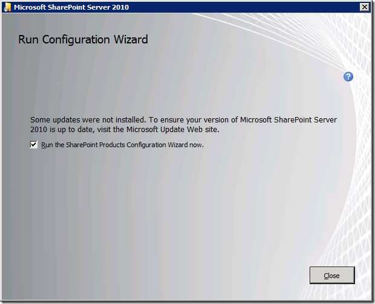

Ever since the release of the August 2012 SharePoint 2010 Cumulative Update (CU), I ([and several others](http://autospinstaller.codeplex.com/discussions/399778)) noticed that, during the SharePoint binary file installation portion of AutoSPInstaller, it would fail with a PatchApplicationFailure error in the SharePoint installation log, if we integrated Service Pack 1 + the August 2012 CU in the SP2010 install media. Since this did **not** happen with any prior CU up to and including June 2012, those of us affected basically thought we’d found a bug in the CU. Famous SharePoint admin dude Todd Klindt even included it on his [Bugs & Regressions](http://www.toddklindt.com/blog/Regressions/August2012CU.aspx) page.

Feeling smug & confident that I’d been part of discovering a sneaky bug, I waited patiently for the latest October 2012 CU to be released, hoping it would provide a fix. Wellll imagine my surprise when I ran into the very SAME issue with the slipstreamed October 2012 CU media… Hang on, I thought. This couldn’t _still_ be an issue with this latest CU. I turned to a good ol’ search of the Interwebz and found a shockingly low number of hits for the problem. Surely, if it were truly a bug then lots more folks would be experiencing it. But the top search hits actually came back to my AutoSPInstaller discussions on the issue. Hmm.

Time to try a manual (non-scripted) install of SharePoint then. Let’s see if it fails, gives a warning, or otherwise indicates a corruption of the install media. What I found was a familiar dialog box, but with a message _I’d never seen before_:

Note the text – “Some updates were not installed”. Well, we know that during our scripted install, some updates were indeed not installed – and this caused AutoSPInstaller to blow up & exit. However, the dialog box above simply notes it as an FYI, and allows us to proceed with the usual Config Wizard. Huh?

I did a comparison of the SharePoint installation log files – the log produced when AutoSPInstaller errored out, and the one associated with the apparently successful manual installation above. To my (repeated) surprise, _both_ logs included the PatchApplicationFailure error. But, although this may be a new thing starting with the August 2012 CU, it apparently isn’t considered something critical enough to cause the installation to fail. Further, I noticed that both logs contained the message: “Successfully installed package: oserver” – which I take to be an indication that the setup process as a whole was a net success.

It soon became clear to me why AutoSPInstaller was bombing out. After the setup of the SharePoint binaries, the script would simply parse the log for the string “Error:” If it found at least one instance of it, it would consider the binary installation a failure and throw an error. This worked fine for every type of slipstreamed installation _until_ the August 2012 CU. For reasons as-yet unknown, this update (and presumably all CUs going forward) does things differently to the effect that a successful installation can still actually contain errors in the log…

Luckily the fix was simple. In addition to parsing the log for the string “Error:”, I now needed to search for the string “Successfully installed package: oserver”, and modify the If statement to look for both the presence of “Error:” and the _absence_ of “Successfully installed package: oserver” – in other words, if there was an error in the log but no message indicating overall success, then AutoSPInstaller should throw an error.

The updated AutoSPInstaller changeset that fixes this problem can be obtained as always from [http://autospinstaller.codeplex.com/SourceControl/list/changesets](http://autospinstaller.codeplex.com/SourceControl/list/changesets "http://autospinstaller.codeplex.com/SourceControl/list/changesets") and will eventually make its way into the default recommended AutoSPInstaller download package.

_Note: At the time of writing this I realized this is seemingly **not** all there is to this issue. [Part 2](http://spinsiders.com/brianlala/2012/12/07/slipstreaming-issues-beginning-with-sharepoint-august-2012-cu-part-2/ "Slipstreaming issues beginning with SharePoint August 2012 CU (Part 2)") of this post will delve deeper – stay tuned!_
