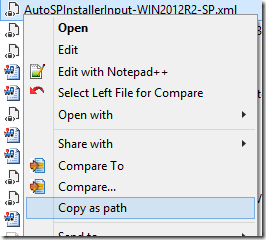
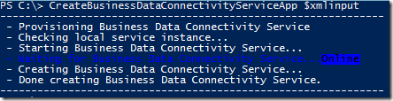

_\-UPDATED May 2019-_

While [AutoSPInstaller](https://autospinstaller.com) (my open-source project for installing SharePoint 2010-2019) is designed so it can be run and re-run as often as required to complete or tweak the installation and initial configuration of a SharePoint farm, there admittedly are times when executing the entire scripted process might seem like overkill.

For example, you might want to provision a service application that you accidentally had left set to “false” the first time around. Or, you might want to rewire which servers in your farm are running the Distributed Cache service (maybe to create a dedicated Cache cluster). Alternately, maybe several months (and changes) have passed since your farm was built, and your level of confidence that something hasn’t diverged from your original XML configuration (to the point of conflicting with it) isn’t rock-solid.

Luckily, since the included file AutoSPInstallerModule.psm1 is, as the filename suggests, now an actual module with a collection of PowerShell functions, you can actually isolate and run these chunks of script code individually. The advantages are twofold: First, you can continue to leverage the consistent and automated approach that helped get your farm built quickly in the first place. Second, you can completely bypass all the redundant steps in the process (such as checking for and creating web apps, adding managed accounts, etc.) and can be assured that only the net-new changes you need will be executed.

To do this, you’ll obviously need the [AutoSPInstaller script files](https://github.com/brianlala/autospinstaller) themselves, as well as the AutoSPInstallerInput\*.xml file you used to originally build the farm (with your new modifications included of course). For the steps below, you’ll want to be logged in as the SharePoint installer account (you _did_ use a [dedicated account to install SharePoint](http://absolute-sharepoint.com/2013/01/sharepoint-2013-service-accounts-best-practices-explained.html), right?)

First, we want to grab the full path to your XML, so we can easily paste it below. A quick shortcut to do this is to shift-right-click the XML file itself and select _Copy as path_:

Now, launch a SharePoint Management Console (as Administrator), and enter the following in order to assign the content of our input file to an XML object:

\[xml\]$xmlinput = (Get-Content "<path to your XML file which you can just paste here>") -replace "localhost", $env:COMPUTERNAME

Note that you can simply paste the path to your XML in the designated space above (by the way, the line above was basically pulled straight from AutoSPInstallerMain.ps1).

Now that our entire XML input file is loaded and available as $xmlinput, we can use it to pass parameters to many of the functions found in AutoSPInstallerModule.psm1. First however we’ll need to make those functions available to us in this console – this is accomplished by simply importing the module. Here we have another one-liner, and if we use the same technique to copy the path to our AutoSPInstallerModule.psm1 as we did above, we can just type something like the following:

Import-Module -Name "C:\\SP\\Automation\\AutoSPInstallerModule.psm1" -Verbose

(TIP: including the -Verbose switch above will output all the available functions for easy reference)

Finally, we’re ready to call nearly any of the functions in AutoSPInstaller (in fact we can use familiar tab-based autocomplete to get their names, too) since they’re loaded in memory for the current PowerShell console.

Let’s say for example we want to provision Business Connectivity Services on this particular server (the one we’re logged on to, that is). We would simply enter:

CreateBusinessDataConnectivityServiceApp $xmlinput

At this point, the BCS service app should get provisioned based on the details in our XML input file:

Note, if nothing happens, it’s likely because you forgot to change the XML Provision attribute from “false” to either “true” or the name of your target server.

That’s really about all there is to it. Hopefully this helps folks who are leery of running the entire monolithic AutoSPInstaller process just to make small changes to their existing farms.

(Oh I realize the current layout & structure of AutoSPInstaller may not be optimal – namely, much of this should probably have been implemented as one or more [PowerShell modules](http://technet.microsoft.com/en-us/library/hh847804.aspx)… it’s in the queue of future enhancements!)

_Update- the entire post above was updated to reflect the fact that the AutoSPInstaller functions file has been converted to a PowerShell module!_
