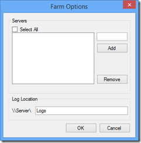

The [new ULSViewer](http://blogs.technet.com/b/wbaer/archive/2014/08/22/uls-viewing-like-a-boss-uls-viewer-is-now-available.aspx) for SharePoint introduces the capability to monitor _all_ the ULS logs in your SharePoint farm at once, in real time. While this is a fantastic enhancement to an already near-perfect piece of software, I found one tiny little pain point with it. When configuring ULSViewer to monitor an entire farm, you need to manually specify all the servers in your farm as well as the common ULS log path.

As a seasoned (crusty) SharePoint IT pro, I thought to myself, “hey ULSViewer, you seem smart… figure it out yourself!” After all, this isn’t top-secret information, it’s all right there within the farm configuration. And being the type of person who hates doing anything manually (especially more than once), I wanted some sort of automated fix.

So I set upon writing a fairly simple PowerShell script that would query the farm to grab all the SharePoint servers in the farm, plus the diagnostic (ULS) logging path. These pieces of information are available via two SharePoint PowerShell cmdlets: Get-SPFarm and Get-SPDiagnosticConfig. The rest was just reading and if necessary adding to ULSViewer’s Settings.XML file.

Head on over to the [TechNet Gallery](http://gallery.technet.microsoft.com/Automatically-Set-eeb1baa2) to grab the PowerShell script for yourself… heck it could even save you _seconds_ of your precious time!
