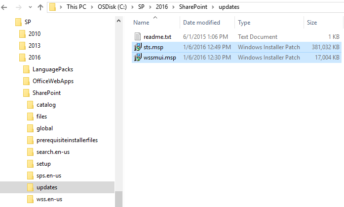
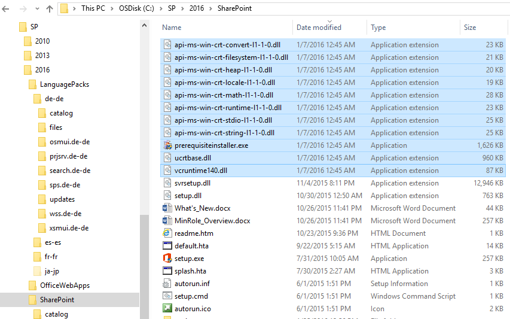
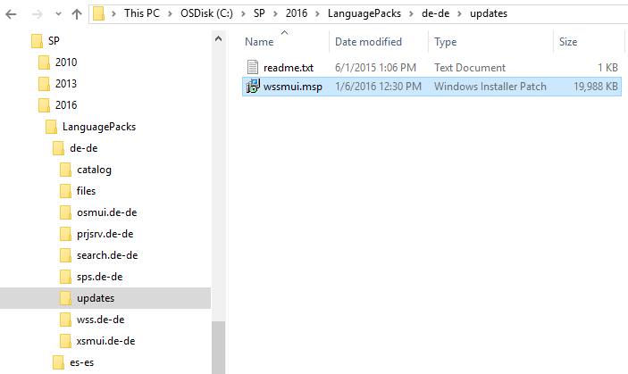
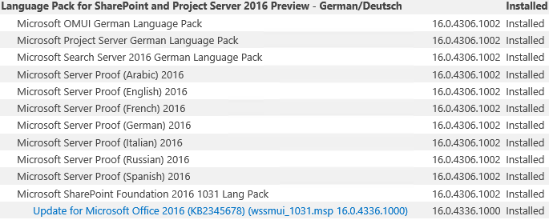
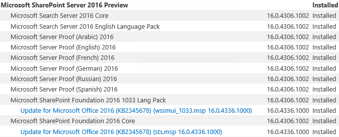

When SharePoint 2016's Release Candidate was [announced](https://blogs.office.com/2016/01/20/sharepoint-server-2016-and-project-server-2016-release-candidate-available/), you may have wondered why (and at the same time been a little sad that) there was no monolithic ISO or executable made available that would allow you to install straight to RC without first having to install the previous public release (Beta 2) first. Well, it turns out there's a fairly simple way to accomplish a direct-to-RC installation, and it uses a tried & true methodology - slipstreaming!

Here are the high-level steps to go from zero to RC (in your non-Production environments, right?):

1. Download the [SharePoint 2016 Beta 2 bits](https://www.microsoft.com/en-us/download/details.aspx?id=49961) if you don't already have them.
2. (optional) [Download any Beta 2 language packs](https://www.microsoft.com/en-us/download/details.aspx?id=49960) you might require.
3. Extract/copy the Beta 2 bits to a suitable local or network folder (e.g. **C:\\SP\\2016\\SharePoint**).
4. (optional) Extract the language pack(s) to a folder relative to the path above (e.g. **C:\\SP\\2016\\LanguagePacks\\xx-xx** (where xx-xx represents a culture ID, such as de-de)).
5. Download the [SharePoint 2016 RC patch](https://www.microsoft.com/en-us/download/details.aspx?id=50737) - and don't forget to select/include the prerequisite installer patch that matches the language of SharePoint 2016 you're installing.
6. Download the [RC language pack](https://www.microsoft.com/en-us/download/details.aspx?id=50736) that matches the language of SharePoint 2016 you're installing (in my case, English). You need this in order to update the built-in language pack.
7. (optional) [Download the corresponding patch for any other language packs](https://www.microsoft.com/en-us/download/details.aspx?id=50736) you downloaded/extracted previously.
8. Extract the RC patch to (using the convention above) **C:\\SP\\2016\\SharePoint\\Updates:**

Note that the **wssmui.msp** shown above is actually the English language pack patch, which you would have obtained from Step 6. above.

9\. Extract the prerequisite installer patch files (downloaded as part of step 5) to **C:\\SP\\2016\\SharePoint**, overwriting any existing files:

10\. (optional) Extract respective RC language patch files to **C:\\SP\\2016\\LanguagePacks\\xx-xx\\Updates**:

Careful! All the language pack RC patch files are called **wssmui.msp** regardless of language, with no quick way to tell them apart. I therefore recommend you extract/copy them one at a time - but again this step only applies if you're actually installing packs for different languages.

11\. Now install SharePoint as you normally would. Patches placed in the correct locations will be automatically picked up and applied during the installation. Note that by this point, the process should look familiar if you've ever done slipstreaming in previous versions of SharePoint.

12\. Once the installation is complete, verify that the patches were successfully applied in <CentralAdminUrl>/\_admin/PatchStatus.aspx. You should see entries for "Update for Microsoft Office 2016 (KB2345678) (wssmui\_<cultureID>.msp 16.0.4336.1000)" under each language pack (if applicable):

And also "Update for Microsoft Office 2016 (KB2345678) (sts.msp 16.0.4336.1000)" under SharePoint 2016 Preview itself:

Oh, and the contents of that "readme.txt" file shown in the screen caps above? "_Any patches placed in this folder will be applied during initial install._" As though the product was, you know, designed for this :)

Cheers Brian
