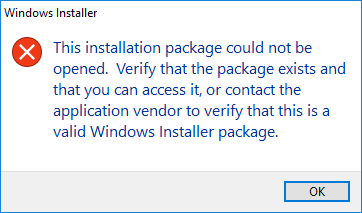
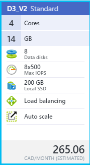
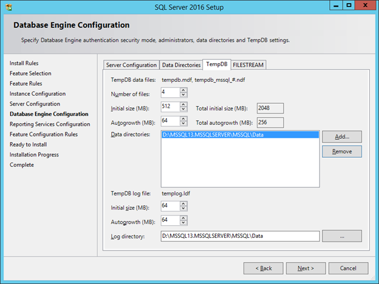
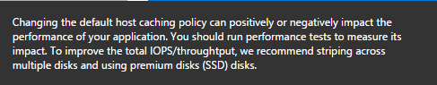

As someone who's been running local Virtual Machines on a beefed-up laptop for several years now, I've found the strategy becoming more cumbersome and challenging as the demands of my main platform of choice (SharePoint) increase with regard to recommended specs. In fact, spec requirements are the main factor that have personally kept me from making the leap to a lighter, less-powerful Surface or similar device - devices which simply don't yet have the horsepower (mainly in the RAM department) to allow me to build/run/test a local SharePoint 201x farm. So at the moment, my laptop (with 2 SSDs, 32 GB RAM, Core i7) is proving pretty difficult to part ways with. It actually out-specs many of my customers' SharePoint VMs... Having said that, with the push to Azure and the ubiquitous cloud model in general, I'm slowly working my way towards the ultimate goal of eventually doing away with the ol' boat anchor of a laptop and running all my stuff in the cloud.

Which brings us to this post regarding Azure Infrastructure as a Service (IaaS) - specifically, how to control costs (or in my case, MSDN credit consumption) while getting decent performance. And in my experience, the biggest single factor in an Azure IaaS virtual machine's performance is storage. And, being a SharePoint guy, I'll try to gear this information around what makes sense for hosting SharePoint VMs in Azure. Admittedly, much of this information is already available out there, my aim is just to assemble and share what's proven helpful for me so far as a relative newcomer in the Azure space. What follows is therefore a combination of discoveries, strategies and scripts I've found useful in my ongoing transition to Azure IaaS.

# Azure File Storage

Generally available since [September 2015](https://azure.microsoft.com/en-us/updates/general-availability-azure-file-storage/), the Azure File Storage offering (in Azure Resource Manager mode) allows you to create shared folders that can effectively be seen by not only your Azure virtual machines but really any endpoint on the Internet with the proper credentials. It has SMB 3.0 support, and (in my case, on an MSDN account at least) supports up to 5 TB (5120 GB) quota per share - plenty of room for your stuff. My own use case for Azure File Storage is to host a cloud-based copy of the SharePoint 2010/2013/2016 binaries, for easy and (somewhat) local proximity to my Azure VMs. Keep in mind this is _persistent storage_ - the files I have placed on my Azure File Storage share will stick around as long as the parent storage account exists - completely independently of the state or existence of my Azure VMs. Another nice thing is I can download software ISOs (e.g. SQL, SharePoint) directly from one of my Azure VMs with lightning speed straight to my Azure File Storage share, then extract the binaries from there.

More for the SharePoint-minded folks: By running [AutoSPSourceBuilder](https://github.com/brianlala/autospsourcebuilder) on one of my Azure VMs, I can save myself a bunch of time and bandwidth by downloading the prerequisites and CU(s) for SharePoint straight to my Azure File Storage share- giving me everything I need software-wise to install SharePoint in Azure IaaS.

And when I do need to upload additional stuff to my Azure share,  a utility called [AZCopy](https://azure.microsoft.com/en-us/documentation/articles/storage-use-azcopy/) comes in very handy at moving files to (and from) different types of Azure storage, not just file shares. I like to think of it as Robocopy for Azure; in fact, many of the command-line switches will be familiar to anyone who's used Robocopy (and what seasoned Windows admin hasn't?), plus AZCopy definitely supercharges your file transfer operations (it'll easily max out your available bandwidth!) You can also use the web interface in the new Azure portal to manage content on your Azure File Storage shares, if you prefer.

## Gotchas

Azure File Storage shares do seem to currently have some quirks. Although most file types run just fine from the UNC path (e.g. \\\\myfilestorage.file.core.windows.net\\share), I've found that certain file types (e.g. MSI) seem to give obscure errors when trying to invoke them, for example:

However, the same file runs just fine if you copy it locally to the VM first. BTW if anyone out there has any clue as to why this happens, I'd love to hear it...

Another thing that comes to mind to watch out for (as it may not be immediately obvious) is that files stored in Azure File Storage can't be ACLed - in other words, the shares don't support NTFS security, because, well, by all indications they aren't stored on an NTFS file system. So if were thinking of using Azure File Storage to host classic file shares in the cloud, you might be better off hosting these shares on an Azure Windows-based VM instead in order to take full advantage of NTFS security.

Also, for some reason AZCopy doesn't retain the original modified times on uploaded files it seems; I haven't found a way to work around this, but for now it remains a minor pain.

# SQL Server Storage

Ask any SQL DBA what keeps them up at night and you'll often get an answer containing "IOPS". Short for **I**nput/output **O**perations **P**er **S**econd, IOPS is one way to measure a particular storage subsystem's speed (it's more complicated than that, but for the purposes of this post we'll just keep it at this level) and is an important factor in overall SQL Server performance. The next thing your sleepless SQL DBA might mutter is something relating to "TempDB". And sure enough, as SharePoint admins we've also been lectured about the [importance of a well-performing TempDB](https://technet.microsoft.com/en-us/library/a96075c6-d315-40a8-a739-49b91c61978f#Section6_5) on our SQL back end instance. The challenge is, running a SharePoint farm in Azure on a budget (or in my case, on CDN $190/mo worth of MSDN credits) doesn't leave you with a really great default storage performance experience on most Azure VM sizes - the stated limit on standard data disks in many lower-end VM sizes is 500 IOPS - not exactly whiplash-inducing. So how can we improve on this?

## TempDB on Temporary Storage

The first option is to leverage a VM size that has SSD (Solid State Disk) available for temporary storage - for example, "D3\_V2 Standard":

Looks promising! We're offered 200 GB of premium local SSD storage... but careful, this is actually only _temporary_ storage, meaning that we stand to irretrievably lose anything and everything on this volume should the VM be stopped/de-provisioned (which, on limited Azure credits, we are quite likely to do). So storing our SQL user database MDF and LDF (data and log) files here is probably a Bad Idea. But, remember our afore-mentioned, IOPS-loving TempDB? By its very nature, the files associated with TempDB aren't (or don't need to be) persistent; they can be re-created every time SQL Server starts up. And given the performance gains that SSD storage gives us, our temporary D: volume is looking _really_ promising.

However (and there's always a catch), getting TempDB to make its, er, permanent home on the temporary D: volume is not entirely straightforward. First, ideally we would want to specify the location of TempDB during installation of SQL Server itself. SQL Server 2016 in fact now gives us more "best practice" oriented options for configuring TempDB, including multiple files and autogrowth, right out of the gate:

Cool right? We just specify the path for our TempDB files as somewhere on the D: drive, and we're good to go... Eeeeexcept when the VM stops and re-starts. Then, SQL starts complaining that it can't access the location of TempDB, and fails to start. What did we do wrong? Well it turns out that while the SQL setup process _is_ able to create new directories (like the one on D: above), SQL Server itself _can't_ create them, and expects a given path to database files to already exist - and due to the temporary nature of our D: drive, the path above was blown away when the VM got de-provisioned. OK fine, you say, let's re-do this but instead of specifying a subdirectory for the TempDB files, we'll just specify the root of D: - but again, not so fast. The problem now is that the SQL Server installer wants to set specific permissions on the location of data and log files, and because we've specified the root of D:, it's unable to, and this time the SQL setup process itself craps out.

The solution to all this is to do a switch - allow the SQL setup process to _initially_ create our TempDB files at some arbitrary subfolder on D:, but then once SQL is installed, we can move the TempDB files to the root of D: (using simple SQL scripts that can be easily found on the Interwebz). The last gotcha is that we'll need to ensure that the account running SQL server is a local admin. Why? Because the first rule of our temporary D: SSD volume is that it can get blown away whenever the VM is re-started/re-provisioned - and that means NTFS permissions on the D: drive are set to defaults as well. Aaaand by default, non-administrators can't write to D:. So, we resolve this last unfortunate situation by simply creating and assigning a special SQL server account and configuring SQL to run under that account (making sure it's a local Admin). Now we're finally set to use the temporary D: SSD volume as the location of our TempDB files and enjoy the improved performance therewith.

## Storage Space for Data/Logs

Another option for increasing storage performance on an Azure IaaS-hosted SQL server is to throw all available disk at it. By this I mean (for example) in the case of our "D3\_V2 Standard" VM size above, we are allowed up to 8 data disks assigned to the VM, each with a maximum of 500 IOPS. Some quick math will reveal that, although still not shattering any performance records, if we can somehow team these disks together, we should be able to see a noticeable performance increase over employing only a single data drive. Again, this isn't really new information, in fact even the official Azure tooltip on the new portal recommends "striping across multiple disks" among other things for improved IOPS (see under VM > Settings > Disks > Attach new disk, Host caching):

This can be achieved by either using the classic software-based striping/RAID tools found in Windows Disk Management, or (my preference) using the more recent Storage Spaces / Pools functionality introduced in Windows Server 2012. By creating a storage pool from all our available disks (perhaps in a striped or mirrored model) we can take advantage of multiple simultaneous I/O operations using multiple disks (in the case of our "D3\_V2 Standard" machine above, we get 8 data disks.) Personally I just use all available disks in a simple stripe set (no parity or mirror) because I'm not storing critical data - your needs may vary. For SQL Server purposes, we can use our newly-provisioned pool of disks as the location of both our system and user data/log files during setup, and subsequently-created databases will automatically and conveniently get created there. As far as cost goes, from what I understand the additional cost incurred by using multiple disks is actually pretty minimal, since we are charged for actual data stored vs. size and number of disks.

### One Storage Pool, or Multiple?

Now, do we want to use all our available Azure data disks in a single large storage pool, or should we create multiple pools out of subsets of disks? To use an oft-quoted consulting phrase, "it depends". You will make certain best practice analyses happier by, for example, splitting out your data and log files onto separate disk volumes. But the real-world performance gains are debatable - sure, you theoretically avoid disk resource contention by putting your data files on 4 disks and your log files on another 4 disks, but at the same time you've reduced the total IOPS available to each by roughly half. I myself prefer to just give my data and log files all available IOPS in a single storage pool / disk / volume (keep in mind that this is all being done on a budget, for non-Production workloads anyhow). In a production scenario, while many of the concepts mentioned in this posts would nevertheless apply, you likely wouldn't have the same constraints anyhow could afford bigger, better and more distributed storage options.

### Sample Code Time!

Y'all know I loves me some PowerShell, especially when it comes to having to do something repeatedly (say, for every target server in a SharePoint farm.) So here's a (badly formatted) function that will create a storage pool w/ simple striping using all available disks, create a virtual disk with a single partition, then format the volume as NTFS using a 64KB cluster size:

function New-StoragePoolAndVirtualDiskFromAvailableDisks ($storagePoolName, $driveLetter) { if ($null \-eq $driveLetter) {$driveLetter \= "S"} $driveLetter \= $driveLetter.TrimEnd(":") \[UInt32\]$allocationUnitSize \= 64KB if ($null \-eq $storagePoolName) {$storagePoolName \= "StoragePool"} \# Create storage pool if it doesn't exist yet if ($null \-eq (Get-StoragePool \-FriendlyName $storagePoolName \-ErrorAction SilentlyContinue)) { Write-Output " - Creating new storage pool \`"$storagePoolName\`"..." New-StoragePool \-FriendlyName $storagePoolName \-PhysicalDisks (Get-PhysicalDisk \-CanPool:$true) \-StorageSubSystemFriendlyName (Get-StorageSubSystem).FriendlyName } else { Write-Output " - Storage pool \`"$storagePoolName\`" already exists - proceeding..." \# Create virtual disk if it doesn't exist yet if ($null \-eq (Get-VirtualDisk \-FriendlyName $storagePoolName \-ErrorAction SilentlyContinue)) { Write-Output " - Creating new disk in $storagePoolName..." $disk \= New-VirtualDisk \-StoragePoolFriendlyName $storagePoolName \-FriendlyName $storagePoolName \-UseMaximumSize \-ProvisioningType Fixed \-AutoWriteCacheSize \-AutoNumberOfColumns \-ResiliencySettingName Simple Write-Output " - Initializing disk..." $disk | Initialize-Disk \-PartitionStyle GPT } else { Write-Output " - Virtual disk already exists - proceeding..." $disk \= Get-VirtualDisk \-FriendlyName $storagePoolName } if ($null \-eq (Get-Partition \-DriveLetter $driveLetter \-ErrorAction SilentlyContinue)) { \# Create and format partition if it doesn't exist yet Write-Output " - Creating new partition at $($driveletter):..." $partition \= New-Partition \-DiskId $disk.UniqueId \-UseMaximumSize \-DriveLetter $driveLetter Write-Output " - Waiting 5 seconds..." Start-Sleep \-Seconds 5 } else { Write-Output " - Partition $($driveletter): already exists - proceeding..." $partition \= Get-Partition \-DriveLetter $driveLetter } if ((Get-Volume \-DriveLetter $partition.DriveLetter \-ErrorAction SilentlyContinue).FileSystem \-ne "NTFS") { Write-Output " - Formatting volume $($partition.DriveLetter):..." $partition | Format-Volume \-FileSystem NTFS \-NewFileSystemLabel $storagePoolName \-AllocationUnitSize $allocationUnitSize \-Confirm:$false } else { Write-Output " - Volume $($partition.DriveLetter): is already formatted." } Write-Output " - Done." }

Note that the script above doesn't actually have an Azure dependencies, so you can pretty much use it on any Win2012 and up VM with available disks.

# SharePoint Storage

So what the heck does all of this have to do with SharePoint (you know, that thing that I usually specialize in)? Well, in addition to improving SharePoint's performance (SQL being the brains and brawn behind SharePoint and all), we can use what we've learned above to create a SharePoint server's recommended logging / data / search index volume. Now the storage performance requirements aren't quite as high for this volume as for those hosting SQL databases, but it's recommended that we put stuff like this on a non-system volume anyhow. So, although we may not have a need for a fast(er), large storage pool of disks, in many cases we're entitled to those disks by virtue of the Azure VM size we've chosen, so why not use 'em.

Speaking of SharePoint VM sizes, here's another sample script that you can use to get VMs suitable for running SharePoint in a particular Azure region (location). It takes the Location Name as input (hint, use Get-AzureRmLocation | Select-Object Location to list available locations) and assumes certain values (for RAM, # of CPUs, # of data disks) but feel free to play around with the numbers to get at the right VM size for your purposes.

function Get-AllAzureRmVmSizesForSharePoint ($locationName) { Add-AzureRmAccount if ($null \-eq $locationName) {$locationName \= "CanadaCentral"} \# Toronto $minDiskCount \= 8 $minMemory \= 8192 $maxMemory \= 16384 $maxCores \= 8 Write-Output " - VM sizes suitable for SharePoint (minimum $minDiskCount data disks, between $minMemory and $maxMemory MB RAM, and $maxCores CPU cores or less) in location \`"$locationName\`":" Get-AzureRmVMSize \-Location $locationName | Where-Object {$\_.MaxDataDiskCount \-ge $minDiskCount \-and $\_.MemoryInMB \-le $maxMemory \-and $\_.MemoryInMB \-ge $minMemory \-and $\_.NumberOfCores \-le $maxCores} }

This particular function of course assumes you have a recent version of the Azure cmdlets installed.

Hope you found this somewhat random post useful. It's basically a summary of the last few months of my experimenting with Azure as an aspiring expert on the platform, and really only scratches the surface of Azure options with regard to storage, VM sizing and automation.

Cheers Brian
