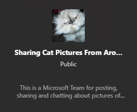
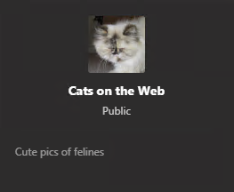

As a Microsoft employee I've been "dogfooding" our new chat-based collaboration hub (Microsoft Teams) for a while now and pretty much enjoying the experience throughout. In the interest of knowledge sharing and wanting to be generally useful, I'd like to raise a usability/discoverability best practice that just materialized for me.

As I was searching for a specific Team to join, I noticed that, in the search results, several teams had issues with their descriptions. Some had no description, others a sub-optimal one, and finally others had a description that looked like it might have been useful, but was cut off prematurely in the Teams UI. Since we at MS have lots and lots of teams, it's vitally important to know what exactly the purpose of the team is - especially a private team (as I wouldn't be able to browse its content until I'm allowed in).

So I humbly propose a quick checklist for creating useful Microsoft Teams descriptions:

1. Actually populate the description (!)
2. Put useful info in there. Remember, folks might be browsing through tens or hundreds of teams trying to find relevant chats and content. Don't make them guess!
3. (And this is the big one) place that useful info at the *start* of the team description. Like, right at the start. Why? Read on...

You see, in the Teams search UI (at least at the time this post was written), the description gets truncated, and unlike the team name, it doesn't expand in a tooltip when you mouse over the description - rather the text changes to a "Join team" button.

So since it seems we currently only have about 80 characters or so to offer a descriptive preview of our team on the search results UI, we shouldn't waste characters at the start of the description, but instead get right to the point! For example, I see a lot of descriptions starting with  “This is a Microsoft Team for the hosting of content for…” Well, we already know it’s a Team. And by design, it hosts content… So our description isn't providing anything useful so far.

Instead, folks would be much better served with a description that starts right away by providing the most useful, unique info, e.g. “For automotive enthusiasts…”, “Expense support and discussions…” or "Only for members of the xyz project..." We can get into the fluffy details later on in the description if we want, as it won't matter as much if this other stuff gets cut off. Again, while this strategy could prove valuable for all teams, it's especially important for private teams (assuming you can search private teams in your tenant; this might still be in preview/testing). I don't want to waste my or the team owner's time by requesting access to a team that I'm not actually interested in (or shouldn't be a member of)…!

**To sum up...**

Bad description:

Good description:

