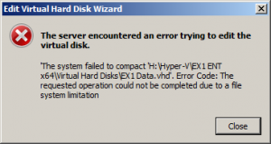

While trying to compact a vhd that had been (unbeknownst to me) generating huge quantities of log files I recently ran across the rather strange "Unable to Compact a VHD Due to a File System Limitation" error:

I found a couple things to try thanks to Google:

- vssadmin delete shadows /all
- [KB982210](http://support.microsoft.com/kb/982210 "The startup time increases or hangs at the logon “Welcome” screen if you frequently backup Hyper-V virtual machines on a Windows Server 2008 R2 system")

But none of those worked.  After a fair amount of digging on the net and around my VM I concluded that I had a grand total of 1280MB in VSS copies stored in my VHD itself.  Then I found [post](http://angrytechnician.wordpress.com/2011/02/23/vssadmin-is-dead-long-live-diskshadow/ "Vssadmin is dead, long live Diskshadow") by [The Angry Technician](http://angrytechnician.wordpress.com/ "The Angry Technician")!  Perfect!!  Diskshadow is the answer.  One simple command to execute, 5 seconds to wait, and everything was good again:

 

**diskshadow** <enter>

**list shadows all** <enter> _(if you want to see them all)_

**delete shadows all** <enter> _(this was specific to my case, you may want to be selective about which shadows to delete)_
