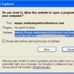
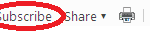

Now that SharePoint Conference 2012 is just a couple days away, I am sure everyone is busy selecting all the sessions they are wanting to attend via [MySPC](http://myspc.mssharepointconference.com/).  As I was admiring my completed calendar, I began to wonder: How I am I going to get this on my phone.  I attempted to import it into my corporate Outlook but that was futile as my iTunes is not on my company laptop.  Back to the drawing board...  What about [outlook.com](http://outlook.com)???  Eureka!  I can add a public calendar to my [Outlook.com](http://outlook.com)!  \*Update: Gmail instructions follow Outlook.com instructions.

Here's how to do it:

1. Log into your [MySPC](http://myspc.mssharepointconference.com/) - probably easiest with IE.
2. On your Calendar, click Export.
3. In the little Do you want to allow... window, Copy the Address value to your clipboard.
    
    \[caption id="attachment\_104" align="alignnone" width="150"\] Calendar Export Image\[/caption\]
4. Log into your [Outlook.com](http://outlook.com) account and navigate to your calendars.
5. Click on the Subscribe link.
    
    \[caption id="attachment\_109" align="alignnone" width="150"\] Subscribe Link\[/caption\]
6. Complete the form:
    1. Make sure that 'Subscribe to a public calendar is selected.
    2. Paste the Url from your clipboard in 'Calendar URL'
    3. Give this calendar a name.  I used MySPC.
    4. Click 'Subscribe to calendar'
7. Now you should have your MySPC calendar connected to your Outlook.com. To sync it with my phone, all I had to do was refresh my calendars associated to my Outlook.com account, but you may have to disconnect and reconnect your calendar sync.

A few things to make note of:

- Pre-req is that you have your Outlook.com account connected to your phone.
- Calender is read-only - just a one way sync is possible.
- Calendar appears to only refresh every 24 hours in your Outlook.com.  This could be problematic if you're changing sessions a lot on the fly, but it's still better than having to carry around a print out.

Gmail:  You must be using an Exchange profile on iPhone or ActiveSync on other devices.

To Sync with Gmail:

1. Follow steps 1-3 from above.
2. Log into your Gmail and open your calenders
3. Under Other Calendars, click Add by URL
4. Once the calendar is added, you can use the edit menu on it to change the name.
5. On your device connected to Gmail by Exchange / ActiveSync, navigate to [http://m.google.com/sync](http://m.google.com/sync) (cannot be on a computer).
6. Select the device you want to configure.
7. Under Shared Calendars, select the calendar you added in Step 3.
8. Click Save.
9. Now you should have your MySPC calendar connected to your Gmail. To sync it with your phone, try refreshing your calendars associated to your Gmail account, but you may have to disconnect and reconnect your calendar sync.

A few things to make note of:

- Pre-req is that you have your Gmail account connected to your phone.
- Calender is read-only - just a one way sync is possible.
- Calendar appears to only refresh every 24 hours in your Gmail.  This could be problematic if you're changing sessions a lot on the fly, but it's still better than having to carry around a print out.

Happy SharePoint Conference Everyone!!
