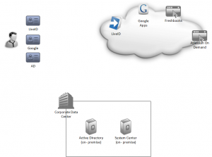
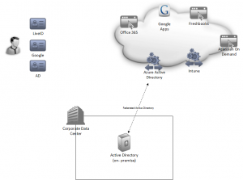

With the full GA release of [Office 365 Wave "15"](http://www.microsoft.com/en-us/news/Press/2013/Feb13/02-27OfficeCommercialGAPR.aspx), I thought it was about time I started to really see what I could do with this platform.  I have been an avid SkyDrive and Outlook.com user for my personal email for sometime now, so why not see what else I can do with the cloud & Office 365 with my little experimental company.  I should also mentioned that my little company is a Microsoft registered partner and I have enrolled in the [Cloud Essentials](https://mspartner.microsoft.com/en/us/pages/solutions/access-cloud-partner-program-benefits.aspx) program to make this endeavour a bit more cost effective.

My objectives for this experiment:

1. Enable Office 365 for my company and federate authentication with my on-premise Active Directory
2. Federate my on-premise Active Directory with Azure Active Directory
3. Leverage Windows Intune to decommission my on-premise System Center deployment

My primary reason behind federating with Azure Active Directory for is really for the challenge - just to see if I can do it.  However, secondary to that is that I am normally working remotely and of course, I would not be very happy if my my company internet connection was down and I could not log into my Office 365 account.  I am aware that I could use the Access Control Services that come with Office 365 and DirSync, but realistically my company may want to authenticate more than just Office 365 against my on-premise Active Directory.

[Here](http://channel9.msdn.com/Series/Windows-Azure-Active-Directory/Windows-Azure-Active-Directory-Cartoon) is a nice video that explains how this federation works.

Here is a little diagram of my current state:

And here is one of my end-state goal:

Thank you to [Buck Woody](http://sqlblog.com/blogs/buck_woody/default.aspx) for the very nice [Azure Visio shapes](http://http://sqlblog.com/blogs/buck_woody/archive/2012/07/25/windows-azure-visio-shapes.aspx)!

I'll be honest - I think this plan is going to work based on what I have read, but I really don't know fore sure.  I will continue to update this post with my full experience as I plug away at this experiment.

\------------------------------

Update 1 (March 6, 2013 8:55 AM MT):

Currently provisioning an new Windows Server 2012 VM using Hyper-V.  I will be adding  the Active Directory role to this server and joining it to my existing domain.  This server will be used to federate with Azure Active Directory for authentication.

Office 365 account is setup and running with my domain. Just waiting to finish with Active Directory before adding user accounts.

\------------------------------

Update 2 (March 6, 2013 10:50 AM MT):

Server 2012 deployed with Active Directory and Active Directory Federated Services running.  Server is joined to my existing domain and has been promoted to a domain controller.  ADFS has been configured and after getting myself a trial SSL certificate, I have been able to add it to my Azure Active Directory service.  This part was surprisingly easy, just ran through the wizards that came with Server 2012 and it appears to be working.  Don't forget that ADFS has to have port 443 open on your firewall.

Next steps: Prove that my Azure AD is working / provide authentication services and figure out how to connect it to Office 365.

\------------------------------

Update 3 (March 6, 2013 1:45 PM MT):

There seems to be a very distinct difference between the 'Active Directory' service you can use via https://manage.windowsazure.com and the Active Directory that is found at https://activedirectory.windowsazure.com.  As far as I can tell, they are both based on the same under-lying service - ACS - but they both seem to offer very different interfaces.

Best I can figure right now, federation was not the correct route.  I should have gone down the DirectorySync (DirSync) route from the bigging.  Now to demote my newly promoted DC and turn it into a DirSync box.  More info [here](http://technet.microsoft.com/library/en-us/jj151831).

And a good [article](http://technet.microsoft.com/en-us/library/jj574104.aspx) on demoting a Server 2012 Domain Controller.

\------------------------------

Update 4 (March 6, 2013 3:20 PM MT):

\------------------------------

Directory Sync is up and running... and syncing all my user accounts and service accounts.  Given that this is really an experimental Active Directory, there are a lot of service accounts.  DirSync really wasn't too bad to get going.  Just took time reading through the guides and waiting for components to install.

Next tasks: Try to filter the user accounts that are sync'd via DirSync and take another crack at SSO.

One good thing to remember: DirSync cannot be on a Domain Control or server running ADFS.

\------------------------------

Update 5 (March 6, 2013 9:10 PM MT):

After lots of research and testing, I have determined that because I signed up for Windows Intune, I am stuck on an Office 365 Wave 14 tenant for the time being.  Service request is open with Microsoft to see if I can do anything about this.  Haven't found a way to force an upgrade yet either.

Still working on SSO.

\------------------------------

Update 6 (March 6, 2013 10:10 PM MT):

A very helpful [post](http://www.windowsitpro.com/article/active-directory/microsoft-active-directory-cloud-windows-azure-active-directory-143222) from [Sean Deuby](http://www.windowsitpro.com/author/5202540/SeanDeuby) seems to be debunking my theory about using Azure Active Directory as an authentication mechanism for my Office 365 tenant:

"If you're running Office 365 with the federated identity + directory synchronization option, you're already running a hybrid Active Directory where your user's on-premises AD identity is authenticated to Office 365 via federation and their accounts are provisioned or de-provisioned in your own little cloud AD via the dirsync process."

I may need to take a closer look at using an Azure VM if I want to achieve this type of authentication distribution as highlighted in [this](http://stackoverflow.com/questions/12949579/setting-up-active-directory-on-azure-as-a-failover-instance) StackOverflow post.

\------------------------------

Update 7 (March 11, 2013 7:30 PM MT):

Well, this sure is proving to be an adventure. After 5 days, numerous emails and phone conversations, the closest I am on getting my tenant either upgraded to Wave 15 from Wave 14 or just simply getting it deleted so I can associate a new tenant with my partner account is being told to contact the partner support group.  I did attempt that today. Tried giving them a call at 6:00 PM PT - the referral I got said that their hours were until 6:30 PM PT time - no luck.

Will update again soon.

\------------------------------

Update 8 (March 12, 2013 10:10 AM MT):

Success! If you are registering as a Microsoft Partner and did not have a Wave 15 tenant - deal with partner support.  I had to end up giving up my original onmicrosoft.com domain, but I also had nothing in my tenant so it didn't really matter to me.  If you don't want to give up your onmicrosoft.com domain or you have content that you don't want to lose, you have to wait for the upgrade email.

On to doing what I started!

\------------------------------

Update 9 (May 17, 2013 12:30 PM MT):

Well, I have managed to get a Wave 15 tenant all set up (got busy of course and this little initiative has taken a bit of a backseat).  I have spend some time researching cloud authentication strategies and I \*think\* password sync with Azure Active Directory is possible, but only with Windows Server 2012 Essentials.  [Here](http://social.technet.microsoft.com/wiki/contents/articles/16168.office-365-integration-service-reports-not-running-after-install-update-rollup-1-for-windows-server-2012-essentials-kb2781267.aspx) is my current evidence for this.  Hopefully I have more time in the coming weeks to to dig more into this.

On the flip side, I do have DirSync running and only synchronizing a subset of my user accounts (have lots of service accounts that certainly don't need to be in Azure AD).  That was fairly easy to set up.  Haven't gone for SSO yet due to the high risk of auth failures if my on-prem connection is down.  Going to take another look at the VPN options from Azure VMs as well.

\------------------------------

Key Learnings:

- If you're going to integrate Office 365 with your on-premise environment, start [here](http://community.office365.com/en-us/forums/183/p/2285/8155.aspx).
- If using Azure Connect to an on-premise DC, be sure to populate the Azure VM's IPv6 DNS address with your on-prem machines Azure Connect IPv6 address.

Resources:

- Good introduction to Active Directory On-Premise to Cloud integration options by [Keith Mayer](http://social.technet.microsoft.com/profile/keithmayer/) can be found [here](http://blogs.technet.com/b/keithmayer/archive/2013/01/06/options-for-building-active-directory-in-the-cloud-with-windows-azure.aspx#.UTep7jCzfw-).
- [Configure filtering for directory synchronization](http://technet.microsoft.com/en-us/library/jj710171.aspx)
- [Upgrading SharePoint Online to Wave 15](http://sharepoint.microsoft.com/blog/Pages/BlogPost.aspx?pID=1052)
- [Provisioning a Windows Azure Active Directory Tenant as an Identity Provider in an ACS Namespace](http://blogs.msdn.com/b/vbertocci/archive/2012/11/07/provisioning-a-directory-tenant-as-an-identity-provider-in-an-acs-namespace.aspx)
- [Single Sign On with Windows Azure Active Directory: a Deep Dive](http://blogs.msdn.com/b/vbertocci/archive/2012/07/12/single-sign-on-with-windows-azure-active-directory-a-deep-dive.aspx)
- Azure Networking: http://www.windowsazure.com/en-us/develop/net/fundamentals/networking/#Connect
- [Joining a Domain via Azure Connect](http://social.msdn.microsoft.com/Forums/en-US/windowsazureconnectivity/thread/a651cfd9-c12c-4db7-8924-8916b9b02346)
