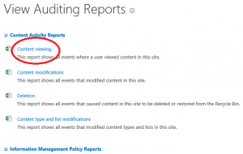
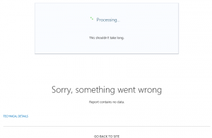

Little important thing to note when evaluating SharePoint Online "Wave 15": SharePoint Online does not have the components to enable View audit log reports.

What does this mean to me you ask... Well, within the View Auditing Reports screen, there is a link named 'Content viewing' (see below).

In full-instance of SharePoint, this would give you a report basically containing who clicked what and when.  In SharePoint Online you will always get "Report contains no data." (see below for example).

 

For more information see: [View audit log reports](http://office.microsoft.com/en-us/sharepoint-help/view-audit-log-reports-HA102772739.aspx), under the 'Events available for audit log reports' section, 'Opened and downloaded documents, viewed items in lists, or viewed item properties' bullet.

Suggestion to Microsoft, hide that report in SharePoint Online. Having that link visible fairly misleading.
