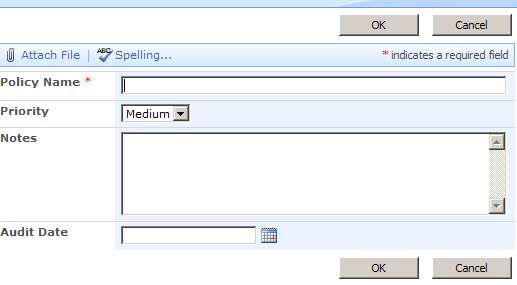
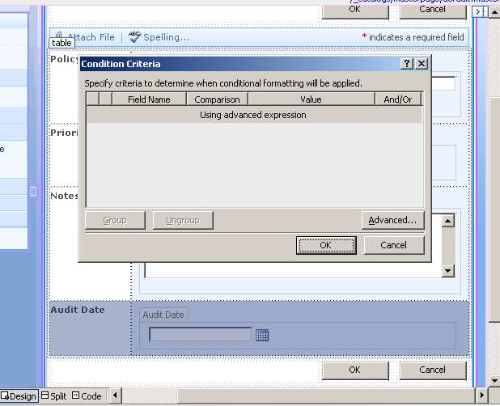
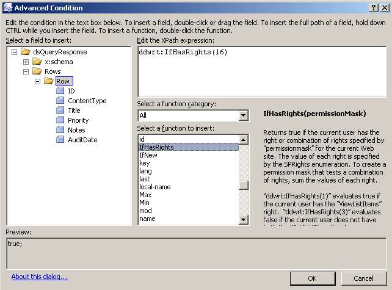
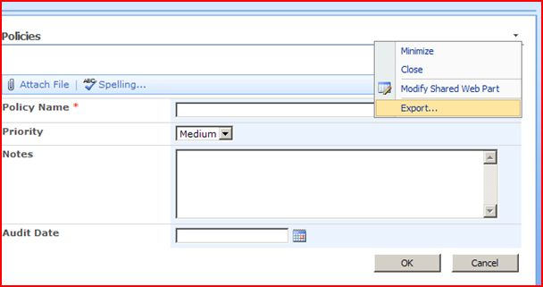

There are situations where certain fields in lists or libraries need to be hidden or displayed according to the permission level of the logged in user.  Since there is really no out-of-box way to assign permissions to fields, here's a way to do it using conditional formatting in SharePoint Designer.  This is my favorite SP Designer trick, that I discovered a few months ago.

See my reference (Ian's SharePoint Blog): [http://www.wssdemo.com/Blog/archive/2007/08/04/sharepoint-data-view-conditional-formatting-based-on-user-permissions.aspx](http://www.wssdemo.com/Blog/archive/2007/08/04/sharepoint-data-view-conditional-formatting-based-on-user-permissions.aspx)

In this example, the field called "Priority" needs to be hidden from everyone except for those users who have rights as approvers on this custom list.  Also, there is a field called "Audit Date", that only approvers need to be able to edit, but other users (even those with edit rights) should not be able to edit this field, and everyone can see it.

Doing this entails creating custom forms for all three forms (NewForm, DispForm, and EditForm) in the list.

Here goes...

1.  To keep this simple, create a custom list called "Policies" on your site.  There are 4 fields:  **Policy Name** (changed from the default Title field) **Priority** - multiple choice **Notes** - multiple lines of text **Audit Date** - date/time

2.  Create a blank web part page in the same site collection as the Policies list.  It doesn't matter where you save it, since we'll be deleting it later.

3.  Open this web part page in SharePoint Designer.  Click on "Click here to insert a Web Part".  This is really just to make sure that you insert this web part into a web part zone, and not some random spot on the page.

4.  On the <Insert> menu, choose SharePoint Controls, then Custom List Form.

5.  Pick the Policies list, then choose New Item Form.  OK   6.  Select the entire table row that contains the Priority field.  This is the field that we want to hide from everyone except approvers.  On the <Data View> menu, choose Conditional Formatting.

7.  In the Conditional Formatting screen on the right, click <Create>, and choose <Show content>.  On the Condition Criteria screen, click <Advanced...>

8.  Select IfHasRights from the list of functions, and then put the number 16 in the parentheses.  To see where I got the number 16 (approver permissions), click on the link to Ian's blog above.  Click OK.  Click OK again.

9.  Next, the Audit field needs to be only editable by list approvers.  So, since this is the new item form, we'll just hide it from everyone else.  So, select the Audit Date row, and put the exact same condition on it with conditional formatting. 

10.  Save this page.  It's okay to customize it from the site definition.

11.  At this point, it does help to have some data in your form, so go ahead and create a couple of list items. 

> Also, I'd like to note that when using custom forms like this, the Attachment button doesn't work anymore.  I think there are blogs somewhere about this bug, but I've never tried fixing it.

12.  Create a new, blank web part page in the same place you created the first one.  This will be the EditForm page.  Repeat steps 3 & 4.  Then, this time when inserting the Custom List form, select "Edit item form". 

13.  Repeat steps 6, 7, and 8 on the priority row.

14.  Next, we essentially need to make two copies of the Audit Date field.  We want it to be editable to list approvers, and visible (not-editable) to anyone else.  Create a new row in the table.

15.  Put the text "Audit Date" in the left cell, and put the cursor in the right cell.  In the <Data Source Details> pane on the right, select the Audit Date field, then click Insert selected field as --> Formatted --> DateTime.  Then, you can opt to uncheck the Time check box, and click OK.

 

16.  Select the row of the editable audit date field.  For the conditional formatting, only show the content when IfHasRights(16). 

17.  Select the row of the read-only date field (the one that was inserted in step 15), and create a conditional formatting rule to HIDE content when IfHasRights(16).

At this point, since you most likely have full control permissions on this list, this row will seem to disappear!  While you're doing this design work and showing/hiding fields, you can go to the Conditional Formatting pane, and click Set Visibility and choose All Formatting hidden.  This will let you see the field you just hid.  Be sure to set it back to default when you're done.

HANG in there, only one more form to go.

You know the drill... create another blank web part page... When you insert the custom list form this time, choose "Display item form" All we have to do on this one is create a conditional formatting rule that will show the content IfHasRights(16)

NOW, it's time to save each of these data views as web parts.  Go to the browser, and navigate to the library where you saved the 3 web part pages you just created.  Open each page export the web part.  Save the \*.webpart files to your desktop or whatever.  In the filename, be sure to indicate whether it's New, Edit, or Display.

In your Policies list, create 3 new, standard views, and call them "New", "Edit", and "Disp".

On each of these new views: - click <site actions> and <edit page>.  Delete the default list view web part.  Be sure to delete it, not just close it. - Import the associated web part from your desktop. - Exit Edit Mode

Now that there are 3 new forms in the Policies list, the last thing to do is associate them correctly. (I think that's the right terminology).  Anyway, go back to SharePoint Designer.

In the left pane, under the Lists folder, right click on the Policies list, and choose "Properties".

Click the "Supporting Files" tab.  Change the content type to Item. Change each of the 3 supporting files to your new Edit, Display, and New aspx files.

Fun!  Now test it!

Once it's just the way you like it, then you can delete those 3 original web part pages that you exported from.  Check it out, we didn't leave anything unghosted!
