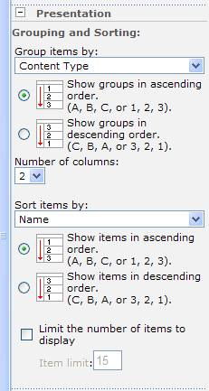
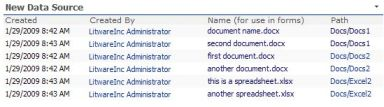

It seems that one of the most commonly asked questions on discussion boards and forums is "How can I display documents from multiple document libraries all in one list?"  So, I decided to enumerate some of the available options to achieve this goal.  They each have their pluses and drawbacks.

## Relevant Documents Web Part

This web part can be used to display documents that are relevant to the current logged in user.  This applies to documents from all document libraries in the current site. Its options are:

- Include documents last modified by be
- Include documents created by me
- Include documents checked out to me

There is also an option to display a link to the document library that each of these files exists in, and an option to set the maximum number of items to be shown.  These documents will always be displayed with the most recent ones first.

The drawback to this web part is that it only displays documents relevant to the current logged in user.

## Content Query Web Part

This web part will let you display documents from the whole site or site collection.  Publishing features need to be turned on for this web part to show in your list of web parts to be added to the page. 

In the web part toolpane, expand the Query section.  In the List Type drop-down box, choose "Document Library".  Then, there are other options such as filtering.   The Presentation section lets you set up options for sorting, grouping, and styles.

The drawback to this web part is that, by default, it will only display the Title field of the document libraries.  If the title field is not filled out for documents, then it will display the full document name (with extension included), such as Newsletter.pdf

Unfortunately, there is no option to set up grouping by document library name.  You can group items by content type, though.  So, for each document library, set up a content type just for that library, and delete the default one.  This way, all items uploaded to that library will be associated with that content type, and when items are displayed as grouped by content type in the Content Query Web Part, this will reflect groupings by document library.

Heather Solomon has a great blog about modifying the Content Query web part.  She shows how to not only modify the fields that are displayed, but the styles also. [http://www.heathersolomon.com/blog/articles/customitemstyle.aspx](http://www.heathersolomon.com/blog/articles/customitemstyle.aspx)

 

## Linked Source in SharePoint Designer

This method is a little more advanced, since it entails using SharePoint Designer.  This allows you to select specific document libraries on your site, and display the items all together, as one single list.  For this to work correctly, all of your the document libraries that you would like to display together need to have identical columns as each other.  So, if you've added any custom columns to one library, then they need to exist on all of the libraries for this to work.

Open the page in SharePoint Designer.  Click on “Click here to insert a Web Part”.  This is really just to make sure that you insert this web part into a web part zone, and not some random spot on the page.  On the <Data View> menu, choose Insert Data View...

1\. In the Data Source Library pane, click "**Create a new linked source**" 2. Click the **Configure Linked Source** button 3. In the SharePoint Libraries section on the left, click to add each of your document libraries. 4.  Click **Next** 5.  Leave the default option to "**merge the contents..."** 6.  Click **Finish** 7.  On the General tab, you can type a name for this new data source.  If you leave it blank, this data source will be called "New Data Source".  It can be changed at any time. 8.  Click **OK**. 9.  Click the drop-down box on your new data source, and click "**Show Data**". 10. Choose the fields that you would like to be displayed, such as Created, Created By, Name, and Path. 11. Click "**Insert Selected Fields As..."** and choose **Multiple Item View**. 12. Ew.  Now the Created By columns looks all messy.  Click on the data in one of the cells in this column. Click the little chevron next to it.  Format as =Label. 13. Now you'll probably want the name of the document to be a link to the document itself.  Click the chevron on a file name, and **Format as= Hyperlink**. Click YES to any notification message.  Address **_(do this first)_**: /{@FileDirRef}/{@FileLeafRef} Text to display: [{@FileLeafRef](mailto:{@FileLeafRef)}

13\. The Path column will show the site/library name that the document is in.  If you'd like to change this to a link to that library, click the chevron on that field, and Format as = hyperlink.  Click YES to any notification message.  Address: /{@FileDirRef} Text to display: {@FileDirRef}

14\. Save the page.

 

Now all of the libraries that you selected will show as one big list.  This data view web part also has other options for sorting, filtering, and much more.  This is much better than the content query web part in that you can customize which columns are displayed.  Unfortunately, it's something that you wouldn't want general users doing, because we don't want everyone editing in SPD.
