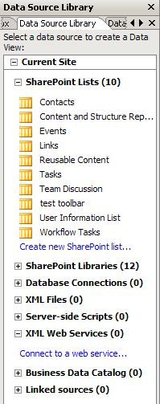
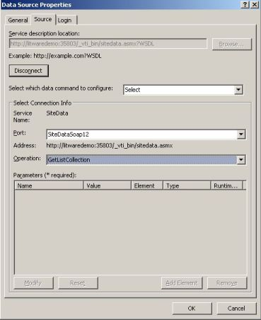
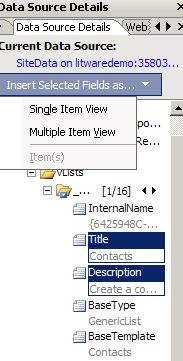
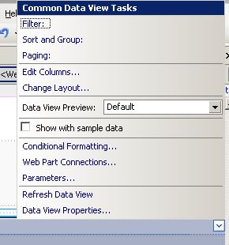
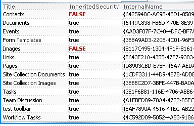
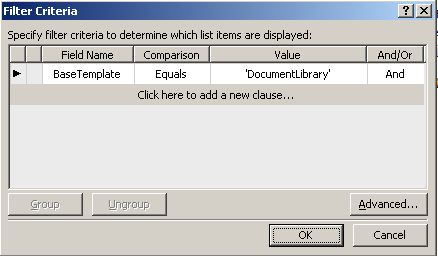
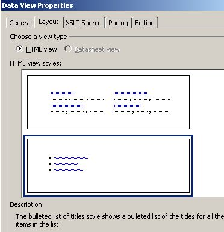
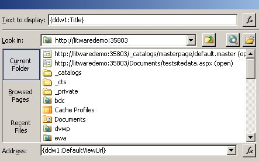
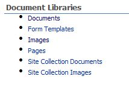

> Twitter users, you can [Re-Tweet This Post](http://twitthis.com/twit?url=http://is.gd/pQ6U "Re-tweet").

There are a whole slew of SharePoint web services, but today I decided to try out the SiteData.asmx one, in a data view web part (the GetListCollection operation in particular).  As I've mentioned before, I'm not a developer, so in a lot of cases, the data view web part (DVWP) has become my best friend.

In various SharePoint discussion threads, message boards, and Q &A panels, there have been many people who have asked the following question:  How can I just display a list of my site's document libraries in a web part?  There are varying reasons for this, such as just wanting to automatically have them all listed together somewhere other than the quick launch.  Good news!  It looks like there's a way to do this, using the SiteData web service and the GetListCollection operation. 

1. Create a blank web part page, and open it up in SharePoint Designer.  Click on “Click here to insert a Web Part”.  This is really just to make sure that you insert this web part into a web part zone, and not some random spot on the page.   
2. On the <Data View> menu at the top, click <**Insert Data View**\>
3. In the Data Source Library pane on the right side, expand "XML Web Services" and click on **Connect to a Web Service**. 
4. Now, on the Data Source Properties screen, I always do this _first_, just so I don't forget.  Go to the <Login> tab, and select **Use Windows Authentication**.  Of course, if you have Kerberos or some other security scenario, you're welcome to pick something else. 
5. Now, go back over to the <Source> tab.  Copy the URL of your site to the clipboard, and paste it into the Service Description Location box.  Then, after it, type: /\_vti\_bin/sitedata.asmx
6. Click <**Connect Now**\>
7. Leave the default Data command as **Select**, and for the Operation, choose **GetListCollection**.  As far as the Port goes, if someone knows the difference between Soap and Soap12, please let me know. 
    
    \[caption id="attachment\_133" align="aligncenter" width="369" caption="Data Source Properties"\]\[/caption\]
    
     
8. Click **OK**
9. Click the drop-down box on the name of the new web service (SiteData on...) and click **Show Data**.
10. Now the Data Source Details task pane appears on the right, which lists all of the fields in the data source.  Select the following fields: **Title, Description ** 
11. Click **Insert Selected Fields as**, and choose **Multiple Item View.** Now, you see a list of all lists and libraries on your site, along with their descriptions, similar to what you see on your View All Site Content page.
12. Now, before we filter it to just show document libraries, I want to show you a couple of other things.  Click inside your list, and click the little chevron at the top right of the list, which will show you a new menu.  
13. Click **Edit Columns**, and add the following columns: Inherited Security, Internal Name See how cool!  Those of you that use the URL of the list settings page to obtain the list GUID may be relieved to see this method of getting it.  Also, wow, _now_ we can see what lists and libraries are inheriting permission from the parent or not! 
14. Just as a side note for fun, you can always click on the data in the first row of the InheritedSecurity column, and choose <Data View>, <Conditional Formatting> and create a new condition so that if the list doesn't inherit permission, the text is red and in all caps: 
15. Now, getting back to the main objective here... to display a list of document libraries.
16. Click inside your list, and click the little chevron at the top right of the list.  Click the word **Filter:**
17. The filter needs to be BaseTemplate equals DocumentLibrary.  Click **OK**.
18. Let's change the way that this list is displayed.  On that same list fly-out menu (or whatever the official name is), click **Data View Properties...**, and go to the <**Layout**\> tab.  Choose the bulleted list of titles, and click **OK**. 
19. Now, the title of the library needs to be a link to the library itself.  Click to select the title of the first document library.  Click the little chevron next to it.
20. In the **Format As** field, select **Hyperlink.**  Click **Yes** at the prompt.
21. Clear the Address field, and click the **Function** box next to it.  Chose the DefaultViewURL field.  Clear the Text To Display box, and choose the Title field for that one.   Click OK. 

There's your pretty little list of all of the document libraries in the site!  Save the web part page, and this is what it will look like in the browser.  Export the web part, save it, and then you can delete the web part page that you created it in.  Now, import this nugget into whatever page it needs to be displayed on.

As I showed him all of the coolness that I discovered in web services, my (developer) co-worker said "I hate to burst your bubble, but developers already know about what's available in the API.  This is all pretty basic stuff". 

I know, I know.  None of this is new to developers, but I'm not a developer, so I think it's great.  It's all new to me.  ;-)
