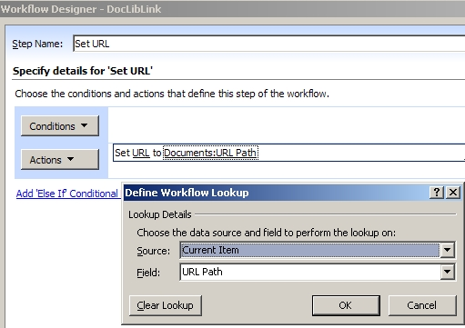
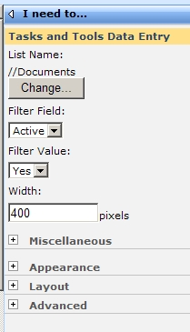
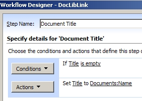

In this article, I'll describe how to use the out-of-box "I Need To..." web part to display a dynamic list of documents in a document library.

**About the "I Need To..." web part**

This web part displays items in a list on the sharepoint site.  The Title field is the field that will be displayed.  The list also must have a hyperlink field, and it must be called "URL".  There must also be a field in the list that is a choice field, to be filtered by.

**Your Document Library** In this example, my document library is called "Documents".

1. Add a new column called "URL", and make it a hyperlink field
2. If you don't already have a choice field you'd like to filter by, add a new column called "Active".  It's a choice field, with the options being Yes or No, with the default as yes.
3. Using SharePoint Designer, create a new workflow that will run when each new item is created or changed in the document library.
4. Call this step in the workflow "Set URL".  There are no conditions, and only one action: **Set Field in Current Item**: Set URL to the current item's URL Path field. 
5. Click <**Finish**\> to save the workflow.
6. Upload a couple of documents to the library, to test this.
7. Add the I Need To web part to your page.  Go to the web part's toolpane.
8. In the List Name box, click the <Change...> button, and select your document library.
9. In the Filter Field box, select "Active" from the drop-down box, and in Filter Value, select Yes.

10. Click **OK**.  Sometimes it makes you check in the page before displaying your changes.

You might see your document names in the drop-down box at this point, but you might not.  The problem is that this web part uses the Title field, and a lot of times that field isn't utilized in document libraries.  There are some options you have at this point:

- Make the Title field a required field in your library.
- OR, put a step in your workflow that will put information in your Title field... Add a second step in the workflow called "Document title".  Condition is "If Title is empty", and Action is to set the Title field to the Documents:Name. 
- OR, put a step in your workflow that will set only the items with Title information as "Active=Yes"... Add a second step in the workflow called "Active Documents".  Condition is "If Title is empty" **AND** "If Active=Yes", then the Action is to set the Active field to No.

Note: At this point, if users change the name of the document, but not the Title, nothing will happen to the title.  But, since this workflow is set to run every time the document is changed, changes to the document names WILL be reflected in the document's URL.

Another thing you might want to do is hide the document library's URL field from forms.  In the library's settings, go to Advanced settings.  Change the setting “Allow management of content types” to Yes. Now, there’s a new section in your library's settings called **Content Types** that contains one content type called “Document”.  Click on the Document content type, click on the URL field, and change it to Hidden.  This will cause the field to be hidden when opening or editing the document properties.  You can do the same for the "Active" field if you'd like.
