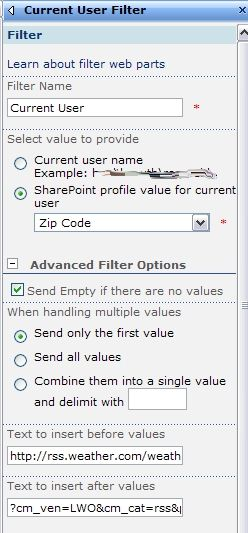
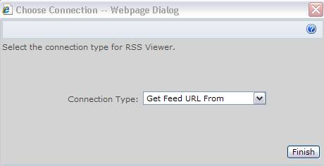

Do you want logged in users to see a RSS feed of their own weather?  If you have MOSS Enterprise, this can be done using the Current User Filter web part and the RSS Viewer web part! 

One thing that needs to be done ahead of time: Your zip code field needs to be set in the SSP as visible by everyone and replicable.  (I'll go over this at the end)

This is the URL that I obtained from the weather.com site, that will display a RSS feed of just weather from my zip code.  See that my zip (35242) is in the middle. http://rss.weather.com/weather/rss/local/**35242**?cm\_ven=LWO&cm\_cat=rss&par=LWO\_rss

1. Add the Current User Filter web part and the RSS Viewer web part to the page.
2. In the Current User Filter properties: Set the SharePoint Profile Value field to "Zip Code"
3. Expand the "**Advanced Filter Options**" section:
4. Dissect the weather URL, and put only the part **_before_** the zip code in the box "Text to insert before values".
5. Put the part of the URL _**after**_ the zip code in the box "Text to insert after values", and click <**OK**\>. 
6. Now, it's just as simple as creating the connection between the two web parts.  On the Current User Filter, click to create a new connection to send filter values to the RSS Viewer web part.
7. Select to "Get Feed URL From" 
8. Done.  Now, your RSS Viewer should display the current logged in user's zip code weather.

So, for those of you who need help with the SSP part, here's how to add the zip code field:

In your SSP, go to "user profiles and properties", and then "View Profile properties".  If you don't see zip code in there, click "New Property".  Change the default privacy setting to Everyone.  Now, you may want to run this by a few people, because once we set this property to Replicable, it will always show on the user info list on each site, and can't be undone.  The Data Soucrce field to map from Active Directory is called **postalCode**.
