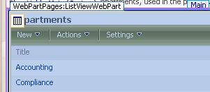

When creating a new view on a SharePoint list or library, there's this little section towards the bottom of the view settings, called **Style**, that looks like this:

 

To see what each style looks like, you could easily modify your view, changing it to each style, one at a time.  I've discovered something in SharePoint Designer allows for a PREVIEW of these built-in styles!

NOTE that you're not going to be modifying a page in SharePoint Designer at this point, only looking at it.

1. Open your site in SharePoint Designer, and double-click to open the default.aspx page (or any aspx page on your site that contains a list view web part).
2. Click to select the list view.
3. As you hover over this list view, look for a little icon that's a picture of a table, like so: (see it on top of the word Departments, at the top left of the web part) 
4. Click the drop-down box on it, and choose "Change Layout"
5. Go to the Layout tab
6. Scroll down through this list, and you'll notice that when you hover over each example, the name of it is displayed, and when you click on each example, there is a description of that view at the bottom!  There's even a radio button on here that lets you change the view type to datasheet view. 

That's your tidbit for the day.  Just close the page you opened, and don't save any changes you made.
