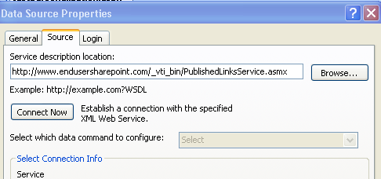
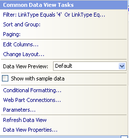
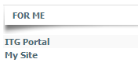

Cool stuff... data view web parts again!  So, here's an idea for a main page for a SharePoint intranet.  This is using the data view web part (in Sharepoint Designer) and a web service.

First of all, for beginners, here's my [Data View Web Part, The Basics - Insert a DVWP on Your Page](http://www.endusersharepoint.com/?p=1629) and there's an associated screencast, too.  (There's a whole series of mine on data view web parts on that site)

Business solution:  I'd like to have a web part on our main SharePoint intranet welcome page, that will show the current logged in user some links that pertain to them specifically.  What better to use than the "Personalization Site Links" that already exist in my SSP!?

Background: When you create Personalization Site Links in your SSP, you're basically targeting specific links to specific audiences or groups of people.  The end result is that when users go to their My Site, there will be a tab at the top for each of the links that is targeted to them.  A good example is to set up a link for each major corporate department, and target it so that everyone in that department will see the link to their department's portal or home page.

Here's how to create a data view web part to utilize the personalization site links:

1. Open up your site and a web part page in SharePoint designer, and in the Data Source Library, click to expand "XML Web Services".  Click to "Connect to a web service".
2. In the "Service description location", paste in the URL of your sharepoint site collection.  At the end of that URL, put a /\_vti\_bin/PublishedLinksService.asmx
3. Go to the <**Login**\> tab, and change it to "Use Windows Authentication".  This, of course, will vary according to your authentication method in your own implementation.
4. On the <**General**\> tab, you can change the name to "Personalization".
5. Back on the <**Source**\> tab, click the <**Connect now**\> button.
6. This is easy, there's only one operation, "GetLinks", so that's the one that should be selected.  Click OK.
7. Click the name of the new web service on the right, and click to "Show Data"
8. I recommend putting all of the fields in a "Multiple item view", just so you can see what all is in there. 
9. All I really want is the Title of the item to show, as a hyperlink to that item, and I only want to see those personalization site links and I'd also like to go ahead and include the My Site link, just in case users don't notice it already at the top right of the page.  You'll notice that there may be other stuff in there, such as sites that you've saved as "My Links".  I see that there's a LinkType field that will help me do a filter, and I found a [Microsoft PDF file](http://www.sharepointusergroup.at/info/Dokumente/UserProfiles.pdf) that has (on page 22) a list of what these Link Types are.
10. Anyway, In my Data view web part, I'm going to filter by LinkType = 4 OR LinkType = 2

13. I went ahead and removed all of the columns except for Title, and I made the title a hyperlink to the URL field in there.  Here's my [screencast](http://www.endusersharepoint.com/?p=1646) on how to do hyperlinks in a DVWP.
14. Wow. Pretty!  Now, I have a cute little web part that I can export, and place it anywhere in my site collection, like the main welcome page! 

