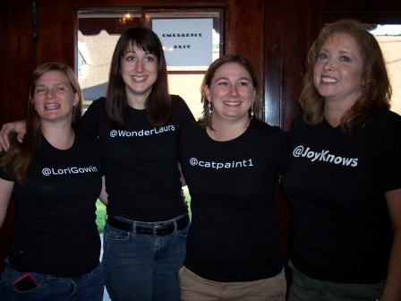

Dear Diary...

No, seriously.  This post is just a recap of what's going on lately with me and the SharePoint community.

Last weekend, Lori Gowin, Cathy Dew and I took a 9 hour road trip from Birmingham, Alabama to Harrison, Arkansas, for SharePoint Saturday - Ozarks.  We recorded a [set of "on the go" videos](http://spinsiders.com/laurar/webcasts/), again, as an homage to Michael Gannotti.  There is a set of 5 videos on the way there, totaling 50 minutes.  Then, there's a set of 3 videos on the way back, total of 25 minutes.  Here's my [Flickr site](http://www.flickr.com/photos/wonderlaura), where I uploaded all (most) of the pictures that I took there.  SharePoint Kevin also took [plenty of pictures](http://www.sharepointkevin.com/SPSOzarks). 

In the video on the way back part 3, we talk about the [SharePoint Saturday](http://www.sharepointsaturday.org) that's going to be in Birmingham, Alabama on Nov 21, 2009.  How exciting!  We're revved up, and looking forward to getting some great speakers to come down to our neck of the woods for this fabuous event.

Let's see, what else... oh yeah, last week on July 21st, I did a presentation at [SharePoint Nation's](http://www.sharepointnation.org/) virtual SharePoint user group meeting!  [Amanda Murphy](http://blog.funknstyle.com/) coordinated this, and [Mark Miller](http://www.endusersharepoint.com) was the host of the event.  My presentation was called "Making the most of out-of-box web parts".  It was recorded on LiveMeeting, and you can view it anytime [HERE](https://www.livemeeting.com/cc/mvp/view?id=SPN04).  You can tell that we all had a lot of fun doing this, and hopefully you'll find it informative.

The next big event I'll be attending will be the Best Practices Conference in Washington, DC on August 24-26, 2009.  Mark Miller of endusersharepoint.com and I will be a media sponsor for the event.  What does this mean?  Basically, Mark and I will have an "EndUserSharePoint" booth, and we be live streaming from the event, doing interviews, and coordinating live blogging in all of the sessions!  [Here is the blog post](http://www.endusersharepoint.com/?p=1709) where Mark announced this.  So, come to this conference, and stop by our booth to say "hi"!

What about data view web parts?  If you're following my blog, you'll notice that I talk about data view web parts a lot.  I've also done an [entire data view web part series](http://www.endusersharepoint.com/?s=data+view+web+part+rogers) on endusersharepoint.com.  So, even though sometimes I forget to put those posts on my blog, a lot of my articles and screencasts are only on that site.  The latest screencast was how to do a join between 2 SharePoint lists, to show data from both of them in one list!

Finally, I thought I'd help promote the [SharePoint Podshow](http://www.sharepointpodshow.com/).  There is going to be a RV road trip ("Road to the SPC") the week before October's big [Microsoft SharePoint Conference](http://www.mssharepointconference.com).  The trip will start in Seattle on October 10th, and will end in Las Vegas around the time that the conference begins.  What the heck is the SharePoint Podshow?  It's a monthly downloadable podshow, where [Rob Foster](http://www.twitter.com/lespaulrob), [Brett Lonsdale](http://www.twitter.com/brettlonsdale) and [Nick Swan](http://www.twitter.com/nickswan) do interviews with big names in the SharePoint community.  This show has been around for about a year, and is getting more and more popular.  So, during the RV road trip in Oct., the plan is to make stops at SharePoint user groups along the way, meet people and make new SharePoint friends.  There will also be  stops at companies, and talk to them about SharePoint, and do demos, etc.  Contact Rob at [Feedback@SharePointpodshow.com](mailto:Feedback@SharePointpodshow.com) if your SPUG or company is along the general route and is interested in a visit.
