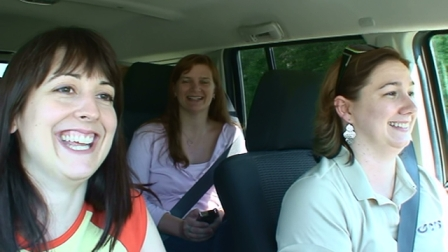

Wow, tomorrow is [SharePoint Saturday in the Ozarks](http://www.sharepointsaturday.org/ozarks) (Harrison, Arkansas), and we're ready!

Cathy Dew, Lori Gowin and are are all going to be speakers, and drove together from Birmingham.  Check out my [Webcasts](http://spinsiders.com/laurar/webcasts) page to see the videos that we recorded on the 9 hour road trip yesterday.  It's 50 minutes, split into five, 10 minute segments.  We talked about many SharePoint subjects such as branding, personalization links, web parts, web services, project timelines, online workshops, InfoPath.

\[caption id="attachment\_318" align="aligncenter" width="448" caption="Laura, Lori, Cathy"\]\[/caption\]

This is my shortest blog post ever, but maybe I'll get inspired later.  We'll definitely take pictures at the speaker dinner tonight.  I just can't wait to see everybody, and people should be arriving pretty soon!
