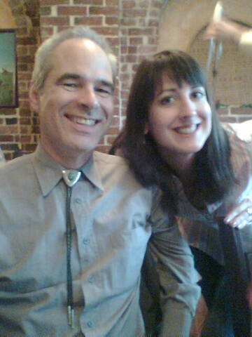

Finally writing my recap of all the fun last week.  What a trip. Uh, oh, I mean.... "Wow, I learned a lot!".

The adventure started out on June 19th, when I flew to Charlotte, NC, from my home in  Birmingham, AL.  Since the speaker party wasn't set to start until 8PM, I had to have dinner beforehand.  I hooked up with [Heather Waterman](http://www.heatherwaterman.com), and her husband and family, for some sushi.  They have 2 adorable boys.  After dinner, Heather and I headed over to the SharePoint Saturday [speaker dinner.](http://www.youtube.com/watch?v=p3EAFjJ772g)  Not only are [these people](http://www.sharepointsaturday.org/charlotte/Pages/speakers.aspx) amazingly talented SharePoint geniuses, but I always have a great time just hanging out with them.  Dan Lewis was the organizer of the whole SharePoint Saturday event.  Kudos to Dan for all the hard work!  After the speaker party, there was another party... in Doug Ware's suite! 

The next morning, we all apparently recuperated (except for Mike and Tony maybe) and headed over to the big event - SharePoint Saturday!  What sessions did I attend?

[**Rick Taylor's**](http://slickrickistheman.spaces.live.com/) session: [Designing a SharePoint Infrastructure for The Cloud “Windows Azure”](http://www.sharepointsaturday.org/charlotte/meetings/13/DesigningaSharePointInfrastructureforTheCloudWindowsAzure.aspx) I didn't know what in the heck "Windows Azure" was, but now I do.  Rick is very dynamic, and gave many real-world examples in his presentation, which was very helpful.

**[Dan Usher's](http://www.sharepointdan.com/)** session: [Designing Effective Logical Architectures, Site Taxonomies and Supporting Infrastructures](http://www.sharepointsaturday.org/charlotte/meetings/5/DesigningEffectiveLogicalArchitecturesSiteTaxonomiesandSupportingInfrastructures.aspx) Dan has a lot of real world experience in designing architecture for large SharePoint deployments, and this really showed in is presentation.

Then, after lunch, there was my wildly popular ["Making the Most of the Out-of-Box Web Parts"](http://www.sharepointsaturday.org/charlotte/meetings/23/MakingtheMostoftheOutofBoxWebParts.aspx) Earlier this year, [Brett Lonsdale](http://www.brettlonsdale.com) and I originally co-presented it at the SharePoint Best Practices conference in San Diego.  Since he's the BDC guru, he did a much better job explaining BDC web parts than I could have.  The premise behind this presentation is that it's a best practice to learn what you can do out-of-box with SharePoint before you go developing your own solutions and web parts. 

[Mike Gannotti](http://socialmedia.mikegannotti.com/) was in the last time slot of the day, with "[Web 2.0 and SharePoint](http://www.sharepointsaturday.org/charlotte/meetings/21/Web20andSharePoint.aspx)" [Mike](http://www.youtube.com/watch?v=tTN-GO0HMgg&feature=channel) is just plain awesome.  I consider him the social media guru, so of course he had a lot to say about the topic.  He not only talked about social media as a concept, but how/when/why it should be used in SharePoint.  I had just met Mike that day, but you know, we're BFF's now.  ;-)  He even put on his SharePoint Samurai outfit, and [interviewed me](http://socialmedia.mikegannotti.com/Lists/Posts/Post.aspx?ID=156). 

Altogether, it was a day to remember.  I got to see many old friends, and made some new ones.  You know who you are.  ;-)  It's funny, I say "old friends", but I've known most of these people for less than a year.  I guess since we've gotten to know each other, it seems like it's been longer.  Again, [Dan Lewis](http://www.sharingthepoint.com/) did an amazing job putting the event together, and was calm and collected the whole time.  [Here are the pictures that I took in Charlotte](http://www.flickr.com/photos/wonderlaura/sets/72157620223201848/).  Here's a [random video](http://www.youtube.com/watch?v=7mOYZwlcJ70&feature=channel) of the day's wrap-up.

**NEXT, I was off to Boston for [SPTECHCON](http://www.sptechcon.com)!**

This was an event that I had been looking forward to for months and months.  This conference is fairly new, and I hadn't been to it before, but I had 3 presentations to do! 

The trip started out rough, with many flight delays because of bad weather in Boston.  It rained the whole time I was there, I think.  Anyway, did I mention how great Twitter is?  Since I tweeted that I had arrived in Boston, and so did [John Ross](http://www.sharepoint911.com/blogs/john) and [Randy Drisgill](http://blog.drisgill.com/), we were able to meet up with each other and share a taxi.  There ended up being a traffic delay because of a wreck, so we really got to know each other, sitting crammed in the back of a cab for an hour or so.

Monday morning at breakfast, I got to meet Mark Miller, of [www.endusersharepoint.com](http://www.endusersharepoint.com). He and I have actually taught online SharePoint training workshops together, but had never met in person.  It was about time!  We were joined at the table by [Mike Watson](http://www.sharepointmadscientist.com/).  "Long time, no see".  Mike had been in Charlotte, too.

Monday at SpTechCon consisted of full day and half day workshops.  I had to see what all the hype was about, so I went to [Todd Klindt](http://www.toddklindt.com) and [Shane Young](http://www.sharepoint911.com)'s session on "**Getting up to Speed as A SharePoint Administrator**".  I had been to one of Todd's sessions at Best Practices in San Diego, about stsadm, but I had never met Shane or seen him speak.  So, now I know Shane.  If you ever get a chance to see these guys present together... they're a great pair.  Not only are they **experts** on the server administration side of SharePoint, but they play off of each other well, and are quite entertaining.  When I mentioned "all the hype" in that first sentence, I was referring to the fact that several people had told me that I _had_ to see Todd and Shane present together.  ;-)

That afternoon, I popped in and out of a couple of sessions: [Bob Mixon](http://bobmixon.com)'s "**Share and Ye Shall Find: Delivering Content That Users Need**" and [Mark Miller](http://www.endusersharepoint.com) and Paul Grenier's session called "**Become Your Company’s SharePoint Superstar!**"

Monday night was a great time.  [I'll just show you the pictures.](http://www.flickr.com/photos/wonderlaura/sets/72157620399910170/) Oh, and [here's a video](http://www.youtube.com/watch?v=u70JYSSYoSo&feature=related) that really captures the spirit of the night.

Tuesday was a little relaxing for me, since I only had one presentation to do.  It was called "HELP! Creating a Community of Support for SharePoint"  This was about the concept of creating a SharePoint Help site for your company.  Research the topics that are of the most interest to your end users, and create a site that is specifically geared towards them and their needs.  You're not creating help content from scratch, just linking to it in an organized way that will make sense to the people looking for help.

Next, I attended Todd Klindt and Mike Watson's "**Disaster Recovery in SharePoint**".  You not only need to have a backup plan, but a recovery plan.  My takeaway: It's important to not only _do_ the backups, but to actually practice the recovery part ahead of time.  Personally, I've pulled an all-nighter at Sungard in Newark, in an exercise where our server team got to practice restoring all of our data, in a real test.  This run-through ensured that we not only had the stuff backed up, but we had perfectly written out DR plans, and could pull it off (the restore) successfully.  This was back when I was in a server support role.

Tuesday at lunch, [Inna Gordin](http://twitter.com/innagordin) recorded this 25 second [video clip](http://www.youtube.com/watch?v=F1HNo1ohWdU&NR=1) of me.

The vendor expo area opened at 2:30.  The conference organizers put in a booth called "**SharePoint Help - 5 Cents**".  The purpose was so that us experts would take turns each sitting in the booth for an hour.  Conference attendees could walk up and just ask us any SharePoint questions.  Cute idea!  I enjoyed talking to people, and even though I think they were shy at first, I did get several questions.  This picture is of me and [Woody Windischman](http://www.thesanitypoint.com/).

\[caption id="attachment\_298" align="aligncenter" width="500" caption="Photo by Randy Drisgill"\]\[/caption\]

After that, I attended [John Stover](http://www.stovereffect.com/)'s "**Data and Views and Forms — Oh My! Building Apps Using The Data View Web Part**".  I love the data view web part, so I love learning more about it.  This session was right up my alley.  It was one big demo.  John walked us through creating data view web parts for a solution where documents in a document library can have comments associated with them.  VERY COOL.  He even showed a couple of situations where you'd splice in a bit of Javascript or Jquery code.

Tuesday night, after the vendor hall reception, was the conference's "Beer and Pizza and Q&A" session, where attendees hung out with all of us and asked SharePoint questions.  The tables each had signs, showing which topics are discussed at that table.  [Here are those pictures.](http://www.flickr.com/photos/wonderlaura/sets/72157620473620205/)  THEN, we had a private speaker party in a suite supplied by the conference organizers.  I was reeling from the absolute amount of genious in that room!  [Here are the pictures.](http://www.flickr.com/photos/wonderlaura/sets/72157620473603159/)

Wednesday, first thing, I had two presentations back to back.  The first one was called "**So THAT’S How! SharePoint and Office 2007 Integration**".  This one was originally supposed to be co-presented with Tiffany Songvilay.  Tiffany ended up not coming on this trip, and she deleted her twitter account.  Here is her [blog about the subject](http://volitionservices.com/ooe/Lists/Posts/Post.aspx?ID=14).  So, since Mark Miller and I have held several workshops on [www.endusersharepoint.com](http://www.endusersharepoint.com), regarding MS Office integration with SharePoint, I invited him to join in on the session.  This was sort of impromptu, but we made the most of it.  The whole presentation was one big demo, anyway, so I think we pulled it off.  The demo was of a policy management system.  In this system, a document library is created for the policies.  Each Word 2007 document is a company policy.  I showed how to insert QuickParts into the document.  This is a cool way of showing docment library metadata _inside_ the word document, not just in the document information panel.  We talked about how content types are used, and showed SharePoint integration with MS Outlook 2007.  The hour FLEW by, the session was packed, and we were thrown a lot of questions.

\[caption id="attachment\_307" align="aligncenter" width="360" caption="Mark Miller and me"\]\[/caption\]

My next presentation was "**Making the Most Of Out-of-the-Box Web Parts**", the one that I had done at SharePoint Saturday in Charlotte.  I think it went over well.  The room was packed and overflowing, which tells me that at least the title of the presentation was enticing enough.  ;-)

Whew, after I was done presenting, the next session I went to was [Paul Swider](http://www.paulswider.com/)'s "**Integrating the SharePoint User Profile Store in the Enterprise**".  This was a great deep dive into audiences and user profiles and properties in the SSP, and how to make use of these features in real-world examples.

Next, I attended "**Seven Ways to Leverage SharePoint for Project Management Success**" by Dux Raymond Sy.  I had heard for a while that [Dux](http://www.meetdux.com/) was a really good speaker, so I couldn't let the conference end without attending one of his sessions.  In this one, Dux talks about the fact that Project Server is a really great product for project management, but a lot of companies aren't to the point that they'll benefit from such a product.  Project Server lets you get into extreme granular detail about projects.  Dux is the project management guru, by the way, and has even written a book called _[SharePoint for Project Management](http://www.oreilly.com/catalog/9780596520144/index.html)_.  Anyway, in this session he talked a lot about what a good tool SharePoint is for project managment, even without Project Server.  I agree wholeheartedly.  Although our project management team where I work _does_ use MS Project Server, I have helped other departments with their own project sites, utilizing such features as content types and data view web parts to create a custom system for them.

Well, that was the last session I was able to go to, before I had to go catch my plane.  Before we all parted ways, though, I was able to sneak in this quick [interview with Todd Klindt](http://www.toddklindt.com/blog/Lists/Posts/Post.aspx?List=56f96349%2D3bb6%2D4087%2D94f4%2D7f95ff4ca81f&ID=144).  Mark Miller held the camera, and we both asked him questions.  I recommend downloading the WMV to your hard drive before watching. 

That trip went by way too fast.  Thanks to all my SharePoint friends... for being such good friends, and for being such amazingly smart geniuses.  To all of you who I didn't specifically mention by name in here, you know who you are.  At first, I was going to attempt to specifically not mention any names at all, because of leaving people out, and because I didn't want this to be just a big list of name-dropping.  This adventure was full of personal interactions, so not mentioning anyone wasn't really possible.  Does that make sense?  I hope so.  My next trip will be to SharePoint Saturday in the Ozarks (Arkansas) on July 18th.  See you there!
