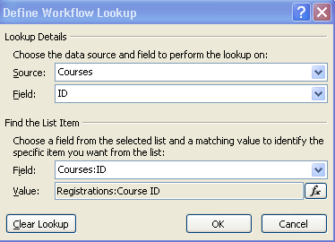

Last week on Stump the Panel, I put up a solution to the following question:

[How to update a user's calendar in Outlook using workflow](http://www.endusersharepoint.com/STP/topic/how-to-update-a-users-calendar-in-outlook-using-workflow "How to update a user's calendar in Outlook using workflow")

Since this seemed to be a popular post, I thought I'd show it to you, and also expound upon it, to show the nitty gritty of how it's done.

Here's how I got to the business solution.  The SharePoint ["Employee Training" template](http://www.microsoft.com/downloads/details.aspx?FamilyId=B5206277-550C-44DA-A2D5-D7E32E3B6B8F&displaylang=en) allows you to add courses to a sharepoint calendar, and users can go to the site and register to take each course.  There are built in workflows, and one of them sends a confirmation email to the person when they register for the course.  So, I wanted the email to not only have a link to the event registration site, but to have a link that allows that registrant to immediately click to add the event to their own personal Outlook calendar.

The workflow already has a part with the "Send an email" action.  For you, if you're looking at the same Employee Training template I'm looking at, you'll want to open the "Attendee Registration" workflow, and then look at the first step of the workflow, where it says "Store This is a confirmation... in Variable: ConfirmationBody.  If you, the reader, are not specifically looking at this template, but want to try this out, just open a workflow and go into the "Send an email" action and follow along.

In the ConfirmationBody, the email body, you want the recipient to have a pretty little link, that when clicked, will open an Outlook appointment.  Where are you going to get the link, you ask?  Go ahead and go into any event item in any SharePoint calendar.  In the toolbar at the top of that item, you'll see an "Export Event" button.  You'll notice that when you click it, an Outlook meeting box pops up, will the info about that specific meeting.  This is the link that you want, so right-click on "Export Event", and copy the link.  I'll show you mine:

> http://webappname/sites/sitename/\_vti\_bin/owssvr.dll?CS=109&Cmd=Display&List={6e63af05-7674-40bb-b487-ba9b01366708}&CacheControl=1&ID=8&Using=event.ics

 We simply want this link to be included in the email to the recipient.  The way to make this link specific to the actual event ID of the relevent list item, will be to replace the ID=8 in the link, to be the ID of the current list item in the workflow.  Go ahead and delete the number after the ID= in your link, and click the <Add Lookup> button.

In this field, you're looking up the ID field from the Courses calendar, and matching it up with the Course ID field in the Registrations list.

This is the full text of what I put in my workflow.  It not only includes a pretty "CLICK HERE" link, it also lets the user know that they'll need to click "Save and Close" once the appointment opens.  Yes, you can use HTML in SharePoint Designer workflow emails.

> If you would like to add this event to your Outlook calendar, <a href="http://webappname/sites/sitename/\_vti\_bin/owssvr.dll?CS=109&Cmd=Display&List={ec72e475-45aa-4f06-83e0-855ec9ca94d4}&CacheControl=1&ID=\[%Courses:ID%\]&Using=event.ics">CLICK HERE</a>, then click to Open, then Save & Close. 

 Just make sure that you use your own site's URL in there, and don't copy it from my site.  Yours will have the correct site URL and unique ID for your list. 

From now on, when people register for events on your training site, they will be able to quickly and easily add that event to their own calendar.  Also, read more on the original question on Stump the Panel to see other people's ideas.  [Eric Alexander](http://alexanderblog.info/?p=239) has written an _entire_ blog series on modifications to the Employee Training template.  He also added a post to this stump the panel entry, about how to create a calculated column with a link to click to add the appointment to your calendar!!
