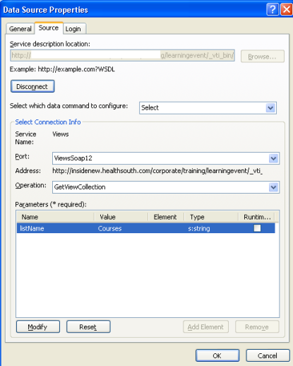
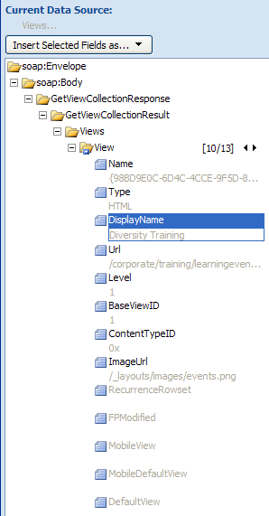

This is another post of a solution related to Microsoft's SharePoint [Employee Training template](http://www.microsoft.com/downloads/details.aspx?FamilyId=B5206277-550C-44DA-A2D5-D7E32E3B6B8F&displaylang=en), but this solution can be used on any list on your site.  Here's the story...

We use this employee training template to set up various training series at work.  For example, if there's some diversity training coming up, there will be a lot of different appointments for this training, and employees can pick a time that's convenient for them, and sign up for one of them.  For each of these series, I've created a view in the Courses SharePoint calendar that filters by the name of that training course, and I've trained the other appointment creators to do the same each time they have a new series.  This makes it easy for them to send out an email, announcing the new training.  They put a link to the filtered view for that training, right in the email.

If users simply went to a list of **all** courses, they may be overwhelmed, because their are so many different and varying courses in the calendar.  They only need to see the list of that one pertinent course at that time.  The payroll department may have a training series on how to use the new financials system, and the HR department may have some courses on diversity, and the community relations department may have some related to upcoming charity events.  So, VIEWS on the calendar allow users to see a list of the one type of training they're looking for, which usually has eight to 10 different date/times that you can pick from to attend.

Anyway, so that's pretty simple... views.  Well, I wanted to take it a step further.  I want the users to be able to go to the main event registration site, and immediately see a list of the types of training that they can register for, which is really just a list of the filtered views on the calendar.  Guess what... there's a web service for that!!  There's a built in web service called views.asmx, and we can tap into it.

First of all, here's [my 5 minute screencast](http://www.endusersharepoint.com/?p=1802), that teaches you how to connect to a web service from within SharePoint Designer.  In the screencast, I demonstrated how to connect to sitedata.asmx, and I also wrote a previous blog entry called "[I Love the SiteData.asmx Web Service](http://spinsiders.com/laurar/2009/03/30/i-love-the-sitedataasmx-web-service/)".

In the example today, though, we'll be connecting to the Views web service instead.  In the **Service Description Location** box, put in the URL of your site, and at the end of it, put /\_vti_bin/views.asmx For example, here's what it would look like http://webapp/sites/sitenamehere/\_vti_bin/views.asmx.  Click to <**Connect**\>

- For Operation, choose "GetViewCollection".
- Double-click on the ListName parameter, and type the name of your list.  In this example, it's the Courses calendar.
- On the Login tab, set it to Windows authentication.  Click OK.
- When you click the name of the new web service source and choose "Get Data", you will see the Data Source Details Pane.

As you will have already seen in my screencast, the data can then be placed on the page as a data view web part.  The Field that I displayed in mine is the "DisplayName", and I used the "URL" field as the hyperlink.  Once you have created this web part on a regular web part page, you can then export it out, and then import it onto any page in your site.  For this example, I put this data view on the main welcome page of the events registration site.

End result? When the calendar owner adds a new series of events to the calendar, she has been instructed to create a view for that set of events, just using a filter by the title field in the view.  Once they have created this view, it will automatically be displayed in the new web part on the event home page!  Therefore, end users can now easily see the types of training available, and click to see the list for that particular type of training, and register for the time that is convenient for them.
