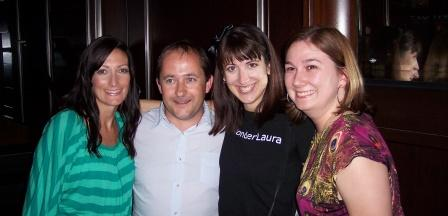

This is continued from [Part 1](http://spinsiders.com/laurar/2009/09/03/bpc09-recap-part-1/).

One of my cohorts at the [End User SharePoint](http://www.endusersharepoint.com) media booth at the [Best Practices Conference](http://www.bestpracticesconference.com) was John Anderson, of Bamboo Nation.  He wrote a series of blog posts during the conference.  [Here's the whole list of them](http://community.bamboosolutions.com/blogs/bambooteamblog/archive/tags/Best+Practices+Conference/BPC09/default.aspx).  Great writing, John!

Altogether, a good time was had by all at the conference, and I always love hanging out with my SharePoint friends.  This is a picture of [@SharepointSara](http://www.twitter.com/sharepointsara), [@AndrewWoody](http://www.twitter.com/andrewwoody) (founder of #SharePint), me, and [@CatPaint1](http://www.twitter.com/catpaint1).

Another fun thing that happened during the conference was getting to be interviewed for the [SharePoint Podshow](http://www.sharepointpodshow.com)!  [Brett Lonsdale](http://www.brettlonsdale.com) and I had done a [co-presentation together](http://community.bamboosolutions.com/blogs/bambooteamblog/archive/2009/02/03/bpspc-making-the-most-of-the-out-of-the-box-web-parts.aspx) at the last Best Practices conference in February, so it was only natural that we record a podshow about data view web parts.  So, stay tuned to see when it goes live on their site.  Speaking of the podshow... they're going to be doing an RV road trip from Seattle to Las Vegas, the week before the big SharePoint conference.  Follow [Road2SPC](http://twitter.com/Road2SPC) on twitter for updates during their trip.

Something very exciting happened in August.  I got a new job!  [Shane Young](http://msmvps.com/blogs/shane) at [SharePoint 911](http://www.sharepoint911.com) has brought me onto the team!  Tomorrow, 9/9/2009 is the start date.  Back in June at [SPTechCon](http://www.sptechcon.com), it was a lot of fun getting to meet and spend time with the SharePoint 911 team.  Who knew?  Anyway, can't wait to get started!  You can follow the SharePoint 911 team on twitter: [@ShanesCows](http://www.twitter.com/shanescows) [@drisgill](http://www.twitter.com/drisgill) [@johnrossjr](http://www.twitter.com/johnrossjr) [@jennifermason](http://www.twitter.com/jennifermason) [@sharepoint911](http://www.twitter.com/sharepoint911).

Speaking of SharePoint 911, a couple of my new colleagues, [John Ross](http://www.twitter.com/johnrossjr) and [Randy Drisgill](http://www.twitter.com/drisgill), live in Orlando, Florida.  There is going to be a [SharePoint Saturday in Tampa](http://www.sharepointsaturday.org/tampa) on November 14th, and we'll all be there!
