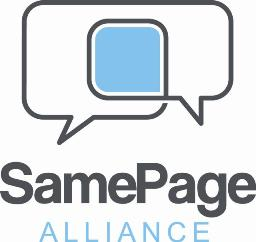

I just got back from the Best Practices 2009 conference in Washington D.C. and I was sitting here asking myself why SharePoint events are so much more fun than just about any other IT related event I've attended over the years. I think it may come down to "collaboration about collaboration" that makes the difference.

When I talk about SharePoint with non-SharePoint IT folks, I always feel like I'm being self-serving when I tell them that "SharePoint is different from any other technology or product you've worked with", but it's true. For example, if you are an expert in Exchange, or SQL Server, you have a pretty circumscribed set of capabilities that you need to implement. That's not to say that these products aren't complex, or difficult to install and maintain properly, but that the "knowledge space" is something that you can draw a circle around. SharePoint is not a product that you can draw a circle around. Even those who come closest to being able to call themselves experts - the Certified Microsoft Masters - are only scratching the surface of the difficulty involved in successfully implementing SharePoint because of the political and social complexity involved in figuring out what your customer wants SharePoint to do and then delivering against that.

So, we need each other. The product is technically large and complex and getting the architecture right is tricky, but much more than that, we need each other to bounce ideas off of - to collaborate. For example: I attended [Jennifer Martinez's session on Blogs and Wikis](http://community.bamboosolutions.com/blogs/bambooteamblog/archive/2009/08/26/bpc-jennifer-martinez-presents-on-blogs-amp-wikis-the-non-social-use-of-great-business-tools.aspx "Jennifer Martinez - Blogs and Wikis"). The room was full and the audience was desperate for information on how and when these tools are appropriate. Even better, the audience shared their experiences to the benefit of all. And there you have it: At SharePoint events, what you hear from the audience, what you learn at lunch and dinner (and of course, at the bar) are the most valuable elements. In a sense, we are all experts in our own little areas; we've tried stuff and we know what worked and what didn't. We have a strong desire to share that information with each other, because we know how badly we need it ourselves.

Because we depend on and need each other, we interact with each other and we socialize with each other and we get to know and like each other. We do most of our socializing and interacting on Twitter and FaceBook and Blogs, but when we all get together in one place at one time, it's like all the separate little flames of light come together and create a bonfire (Ok, that was really sappy, but I'm not deleting it: It sounds right to me).  Because we spend so much of our time trying to help our clients to collaborate, we have become experts in collaboration ourselves: We don't hoard our information, we share it, knowing that by doing so, we will be paid back multiple times over. We exhibit our own best practice!

One of the things that make each of these events fun for me is the growth of the group as an ever wider circle of people come together. Three people that I knew on-line but had never met were Lori Gowin (@LoriGowin), Dan Usher (@usher) and Sarah Haase (@sarahhaase); it was great to get to know them in-person. On the night of SharePint, I had a great dinner with Michelle Strah (@Cyberslate) and Imogen Jolly (@imogenjolly), two people whom I had never met before that day. We got Imogen hooked up on twitter during dinner (I love my iPhone). Talking with Evan Burfield and team was an amazing experience and one of the highlights of the week.

\[Note: When you see @Name, that denotes the person's twitter ID. e.g. www.twitter.com/lorigowin - I've included the ones that I know\]

As many of you heard at various sessions during BPC09, Andrew Woodward (@andrewwoody), Dux Sy (@meetdux), Paul Culmsee (@PaulCulmsee) and I (@RuvenG) have formed a group called the SamePage Alliance based on our similar thoughts and ideas about how to get to success with SharePoint. After months of conference calls, MSN chats and e-mails it was great to get the team together to discuss ideas and strategy in-person. Special thanks to Dux for his incredible hospitality to us foreigners (from Canada, England & Australia).

I am really proud to be a member of this group: Dux had the highest rated single session of the entire conference for his tour-de-force presentation on Project Management. The rest of us each had double-solo sessions with Andrew scoring the highest rated overall. I was third and Paul was fourth for double-sessions in the SharePoint Track (there was a SQL Server track as well). We had planned to run a mini-conference of our own just before BPC09, but did not reach our minimum number of enrolees. We took advantage of the free time to arrive a few days early anyway and we had a set of great meetings. The number of people attending each of our sessions at BPC09 (and the great feedback) makes us feel that we are delivering information that people need and want; we just have to find a better way to get the word out. Watch out for future information from us.

The keynote presentation was by Arpan Shah. It was great that he came out to speak, but with the NDA still in effect and the big SPC just a month or so away, there was not a lot of new information. The one element that I found really exciting (with some reservations until I see it actually working) is Access Services for SharePoint. This will allow a user to create forms and reports in MS-Access and then upload them to SharePoint where they will be accessible from the browser.  MS-Access is a very much loved and hated product: Loved by users who can build a database application quickly and hated by IT who has to deal with mission critical data on uncontrolled systems. This just may be the solution that brings the two sides together.

I found Virgil Carroll's (@vman916) session on multi-lingual SharePoint to be very valuable in confirming that Microsoft's out-of-the-box story on multi-lingual is just not very good.

Zlatan Dzinic (@ZlatanDzinic) was another person who was new to me. I'm sorry I missed his session on records management, but found a lot of similarities between us during his taxonomy talk. Zlatan is a great guy who I look forward to getting to know (despite the fact that he talked non-stop through one of my presentations!).

If you could not be there in person at the event, Mark Miller (@EUSP) from EndUserSharePoint.com did a fantastic job of getting the word out by setting up live-blogging facilities and live streaming. Thanks to everyone who contributed to this effort which was led by the ‘Bama Girls: Lori (@LoriGowin) , Cathy (@catpaint1) and Laura (@WonderLaura). [Bamboo Nation](http://community.bamboosolutions.com/ "Bamboo Nation") was also working hard to get the word out. Thanks to John Anderson for doing such a good job blogging many sessions ([including one of mine!](http://community.bamboosolutions.com/blogs/bambooteamblog/archive/2009/08/25/bpc-ruven-gotz-on-content-types-amp-site-columns-working-with-stakeholders-to-build-the-taxonomy.aspx "Ruven Gotz SharePoint Content Types and Site Columns, Building the Taxonomy"))

There are too many other great people to mention, but I couldn't be done without a shout-out to the Late Night crew: Brett Lonsdale (@brettlonsdale), Sara Windhorst (@sharepointsara), Mike Ferrara (@mikecferrara), Richard Young (@spdick), Dan Usher (@usher), Laura Rogers (the ineffable @WonderLaura), Cathy Dew (@catpaint1) and various others that I'm too tired to remember.

This was my third BPC and it was once again very well organized and run: Hats off to Mark Elgersma and his team, as well as Paul Schaeflein, Ben Curry and Bill English for a great event.

You can read more BPC09 recaps from others here:

[Lori Gowin](http://www.pointgowin.com/SeeThePoint/Lists/Posts/Post.aspx?List=8436e2d5%2D7526%2D409a%2Db7f3%2De49da113abd5&ID=14 "Lori Gowin BPC09 Recap")

[Paul Culmsee](http://www.cleverworkarounds.com/2009/08/28/bpc-09-august-wrap-up/ "Paul Culmsee BPC09")

While I was at the BPC conference, I found out that I will be attending the [SharePoint Conference](http://www.mssharepointconference.com/Pages/default.aspx "SharePoint Conference") in Las Vegas this October. I'm looking forward to hearing all about SharePoint 2010, meeting my friends, making new ones and continuing to learn from my community - I hope to see you there!
