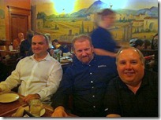

I’m back home after a wonderful and exhausting SharePoint Technical Conference.

I go to these conferences for three main reasons:

1. To learn (there’s no better way to avoid pain than learning from the hard-won knowledge of others)
    
2. To speak (giving back to the community, and learning from my audience)
    
3. To spend time with an awesome group of wonderful people (a great mix of old friends and new)
    

SPTechCon hit all three points for me. I went to great sessions with Laura Rogers, Mark Miller, Andrew Connell, Gary LaPointe, Randy Drisgill, John Ross, Mauro Cardarelli, Joshua Haebets and Steve Fox.

I presented three sessions, and a quick glance at the evals (and chatting with attendees) leads me to believe that I provided good value to those who took the time to attend.

And, finally, this was an event with a great collection of SharePoint people (speakers, attendees and sponsors) who know how to have fun both during and after work hours.

## My Sessions

My first session was “**Mind Mapping tools for the Information Architect**”. There are no slides because I use Mind Manager to present, but you can see a PDF of the main map and all examples here: [http://bit.ly/SPTechCon-MM](http://bit.ly/SPTechCon-MM "http://bit.ly/SPTechCon-MM")

The tools that I demonstrated in that session were:

MindJet Mind Manager: [http://www.mindjet.com/](http://www.mindjet.com/)  
Balsamiq Mockups: [http://balsamiq.com/](http://balsamiq.com/)  
Bizagi Process Modeller: [bizagi.com](http://www.bizagi.com/index.php?option=com_content&view=article&id=27&catid=5&Itemid=98)  
Microsoft Visio 2010: [http://office.microsoft.com/en-us/visio/](http://office.microsoft.com/en-us/visio/)

My second session was “**Explaining Metadata to Your Stakeholders**” . You can download my deck plus I’ve posted the tools that I’ve developed. I do this because? \_\_\_\_\_\_\_\_\_\_\_\_ (My attendees know the answer to that question)  
[http://bit.ly/SPTechCon-ExpMD](http://bit.ly/SPTechCon-ExpMD "http://bit.ly/SPTechCon-ExpMD")

My third session was “**Metadata Management with (Oh No...!) Folders in SharePoint 2010**”. This was mostly a demo session, but I find it annoying whenever I download a deck that has three intro slides followed by a slide that says “DEMO” with no further detail. So, my deck has screen-shots of almost every screen that I demo’ed.  
[http://bit.ly/SPTechCon-MD-Folders](http://bit.ly/SPTechCon-MD-Folders "http://bit.ly/SPTechCon-MD-Folders")

NOTE: In my third session, quite a few people were interested to hear about how my VM was hosted “in the cloud” using Amazon EC2 Web Service ([aws.amazon.com](http://aws.amazon.com)). The cool thing about this service is that you only get charged ($0.50/hr) while your machine is on. Turn it on for the session, turn it off again after; costs a dollar (plus bandwidth and storage, but they are very reasonable too). Go [here for a great blog](http://bit.ly/cIOnfy) that gives instructions on how to do this.

A few people told me they liked my invented company for illustrating taxonomy issues: _Multi_ **Mega** Industries, the world’s number one supplier of missiles, produce and soap.

## The Conference

The conference itself was well run. Thanks to David Rubenstein, Kathy Bruin and their capable team for always being there (I had a few special requests).

With a sell-out of over 1,000 attendees, the rooms were sometimes overcrowded and hot, and the show floor was constantly packed (which was good for the vendors, I heard). Next year, SPTechCon will be at a larger venue which will be better able to accommodate the large numbers of attendees.

## The Community

It was great seeing old friends and meeting new people.

A lot of the ‘fun’ of this trip centered around Mark Rackley (the SharePoint Hillbilly). The constant crew included John Ferringer, Brian Jackett, Brian Hunt and Tasha Scott. Along the way we’d pick up Michael Doyle (@SharePointNinja), Geoff Varosky, Joshua Carlisle, Susan Lennon, Sean McDonough and Erica Toelle (one of my favourite people). In an action packed evening we had Japanese Hibachi for dinner, then moving on for drinks (and figuring out the stained glass caricatures at John Harvard’s in Harvard Square. It was great to finally meet Andrew Connell in person (he was channelling Maverick from Top Gun that evening). I met a new friend - Shelby Boyd - followed by memorable karaoke at Maluken.

Speaking of new friends; on the first night while checking in I met Steve Pellegato. We immediately hit it off and had a great dinner at an Irish pub and then went off to find Mark.

It’s always great to hang with the “frequent flyers club”: Joel Oleson, and Paul Swider. Along with Christian Buckley (nice chats about life and family), Fabian Williams, Mike Ferrara, Geoff Varosky and Jim Bob Howard we had a late-night tour of Quincy Market. This was after a great dinner of Afghan food with Joel, Mark Miller, Brett Lonsdale and Sara Windhorst, Marcee Henon and Dux Sy.

On the final night Joel drove us (the usual suspects plus my fellow Torontonian, Rob Windsor) to an Italian restaurant in Boston’s North End  called La Famiglia Giorgio which came highly recommended by Andrew Connell. We had a delicious and huge dinner. It was a little crowded: We squeezed 8 people into space for six, including Jim Bob sharing a spot at a neighbouring table (it was the kind of place where that was OK).

It had been many years since I had spent much time in Boston. It’s a great town that I really enjoyed. The icing on the cake was a giant regatta on the Charles on a crisp and sunny fall day.

My SPTechCon experience was wonderful in all respects and I thank all those who helped make it that way: See you at the next one in San Francisco!
