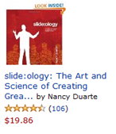
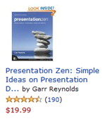
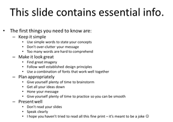
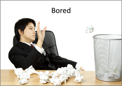
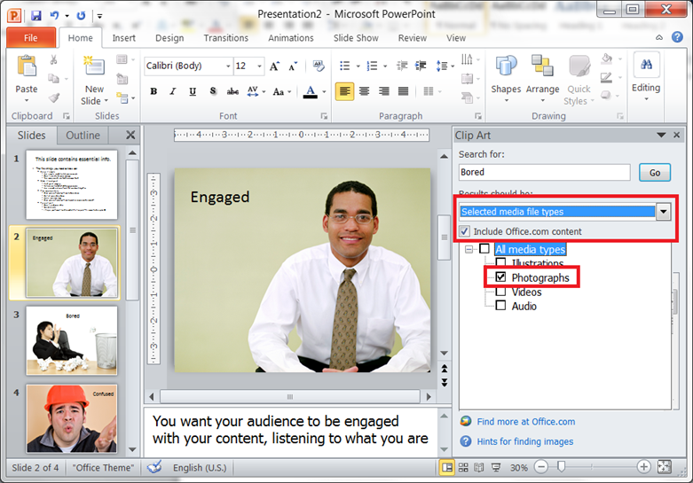
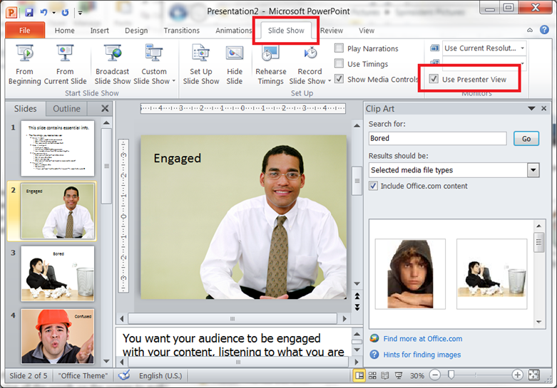
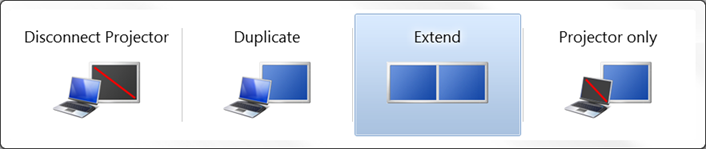
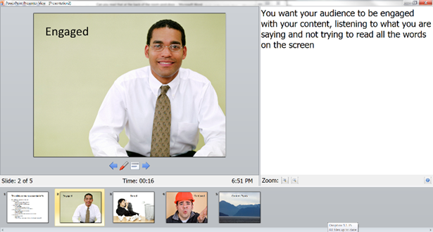

**_How a couple of books have radically changed my PowerPoint presentations._**

I do a fair number of presentations. I speak to our internal teams, to our clients, and to attendees at conferences. While I feel that I have pretty good content, I want to do a better job of conveying my message in a more engaging way. One of the unexpected benefits of joining Navantis is that we have a great library of books on many tech and non-tech subjects. When I saw books about creating better presentations: "[Slide:ology](http://www.amazon.com/slide-ology-Science-Creating-Presentations/dp/0596522347)" by Nancy Duarte and "[Presentation Zen](http://www.amazon.com/Presentation-Zen-Simple-Design-Delivery/dp/0321525655)" by Garr Reynolds. I checked them out.

These books are beautifully laid out (as you would hope) and cover a number of topics on presentation planning, design and delivery. I have a long way to go to truly learn their techniques and incorporate their design advice, but I am a guy who likes to find solutions that follow the 80/20 rule: I like to get 80% of the value of an ideal solution for 20% of the cost (in time, effort or dollars). So here are the two things that I learned that I was able to incorporate quickly, and that have made a huge difference:

1. **People can either listen to you talk, or they can read your slides. Since you are there anyway, they may as well listen to you.**
2. **PowerPoint gives you access to a pretty wide selection of great looking, free images.**

Notice that the essential element of point 1 doesn't deal with rules that I've seen on-line like the 1-6-6 rule, which says: 1 concept per slide, max 6 bullet points, max 6 words per bullet. The whole idea is to minimize or remove words altogether.

Now, if you present a lot, you may think: Ok, I may say a bunch of good stuff in my presentations, but I need to be able to leave something behind that people can read, so they can remember what I said. Or you sometimes need facts and figures to back up your statements. This leads to what Reynolds calls "[sliduments](http://www.presentationzen.com/presentationzen/2006/04/slideuments_and.html)" – ugly creatures that are neither great for presentations nor a really good document either.

What I do with my decks is make them as good as I can for presenting, but I put detailed explanations, references, footnotes and links into the speaker's notes. That way, the 'leave behind' presentation (or a print-out of the deck using the 'notes' format), gives everyone the detail that they need, along with the images that remind them of the concept that I was talking about.

Don't get me wrong; doing this is not easy. It can more than double the time that it takes me to put together a deck. I also need to practice my presentations more, because the slides are no longer cue-cards that remind me of what I wanted to say.

The second point is that when I started working on these types of slides, I had to go sites like [iStockPhoto](http://www.istockphoto.com/) to purchase images. While the images I needed were only a few dollars each, it could add up to more than $50 for a deck.

I know that most of us are pretty familiar with the often silly or overused clip-art that Office has been giving us for years. But I was pleasantly surprised to find that office also has a huge library of really good, free photo-images. They can be accessed from within PowerPoint, but they can also be accessed directly from here: [http://office.microsoft.com/en-us/images](http://office.microsoft.com/en-us/images)

 

_The three images above are taken from the Microsoft Office Images Library. I have used them to imagine that I was presenting on 'effective presentations'. I would talk about my goals as a speaker to avoid confusion and boredom, and work towards engagement with my audience._

The trick to getting at these images from within PowerPoint is to turn off the search from showing you all the clip-art and animations, and just show you the high-quality photographs. This is how to make this work:

It's important to have a broad selection of high-quality images. It can really undermine the quality of your presentation if you take images from the web and then stretch them to fit; they become fuzzy and pixelated, which is distracting to your audience. You want to avoid anything that will distract from your message. The other reason not to just grab stuff from the web is that you may be infringing on someone's copyright. It's wrong, and you don't want to get a lawyer's letter when you post your deck publicly to SlideShare or some other site.

The other reason that you need a really good selection is that while a slide full of words does not make for a great presentation, a slide with an image that makes no sense to the audience can be even worse. Instead of concentrating on what you're saying, they're concentrating on the question: Why am I looking at a picture of a mountain range when talking about content types? Some of the toughest work that I do with this type of presentation is to be creative about finding illustrations that evoke the point that I'm trying to make without causing the attendee to spend too much time thinking about it. (If the Microsoft Office image library doesn't have anything I can use, I still end up going to a stock photo service to find something that will work. It's a small price to pay for a high-quality presentation.)

Presenting these types of decks requires more preparation time so that you can deliver the content smoothly even though you don't have all the words on the screen to guide you. There is a feature in PowerPoint that many people don't know about. It is called "Presenter View" and it allows the presenter to use the projector (or other screen) to show the slides, while showing the presenter a special view that allows them to see the next few slides, and the speakers' notes. Here is how you enable this view:

 

To use this view, you have to choose "Extend" not "Duplicate" when you plug the projector into your laptop. The fastest and simplest way to make sure you have the right setting is to press the "Windows+P" key combination. (This is also a handy way to switch back to "Duplicate" mode when you need to run a demo.)

 

 

And here is how the presenter view looks on your laptop during your presentation: (You can see the main slide – including animations – the speaker's notes in the window on the right, and the time and presentation length, as well as the next few slides at the bottom.)

 

I hope that you will be able to find this information and these references useful in your own presentations. I am now trying to think about how to take my presentations to the next level. Nancy Duarte has a new book out called "[Resonate](http://www.amazon.com/Resonate-Present-Stories-Transform-Audiences/dp/0470632011)", in which she talks about how to take your audience on a journey with you, and transform them in the process. That may sound overly ambitious for a technical presentation, but aren't we all speaking on topics that we hope will transform our audience into more capable developers, administrators, or users? I think that there is a lot we can take from this that will make our presentations more effective. Happy presenting!
