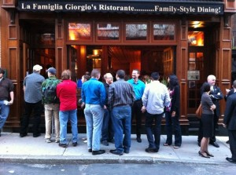
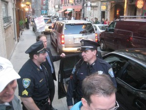
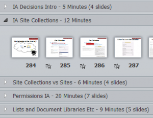
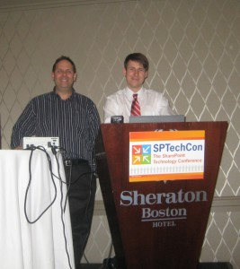
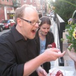

\[caption id="attachment\_55" align="alignleft" width="300" caption="Waiting in front of La Famiglia Giorgio"\]\[/caption\]

Ok, that title is a bit of stretch. Here’s the explanation: Richard Harbridge and I gave a full-day workshop on Information Architecture that included over 400 slides in 8.5 hours. If that’s not ‘singing for your supper’, I don’t know what is. Then, on the last night of the conference, we went to La Famiglia Giorgio in Boston’s North End for dinner. This is a fantastic, family-style restaurant that we ate at last year based on Andrew Connell’s recommendation. We waited outside for more than an hour, while seeing that there was an empty table just sitting there.

\[caption id="attachment\_64" align="alignright" width="300" caption="The cops make us move away"\]\[/caption\]

At one point, the police and a few guys in suits and earpieces made us move up the sidewalk while a convoy of vehicles with tinted glass and flashing lights stopped in front of the restaurant. We found out that it was the Prime Minister of Singapore and family coming to La Famiglia for dinner. (We were finally seated very soon after that, so you could say that we ate dinner with the Singapore PM.)

Richard and I have known each other for a long time and we have many overlapping ideas on how to get to SharePoint success. When we were accepted to speak at SPTechCon we thought: Let’s combine our topics into a monster, all-day workshop. We started collaborating via online meetings where we used MindManager to map out our goals, topics, examples and user exercises. Anyone who knows Richard knows that he is an ‘Idea Inflationist’, a term I coined to describe his tendency to take the germ of a little idea and explode it into a full-blown extravaganza. If we had used all of his (admittedly great) ideas, we would have required at least four days for the workshop.

\[caption id="attachment\_65" align="alignleft" width="300" caption="PowerPoint Sections Screen Shot"\]\[/caption\]

Actually getting all of our slides into a single deck really went into high-gear in the two weeks before the event and I flew in to Boston on Tuesday night and went to Richard’s office where we worked until midnight to make sure everything flowed and that we’d be able to get through most of what we wanted to cover (without running out of content early). \[By the way, check out the ‘sections’ feature of PowerPoint 2010. It was a life-saver for this large deck.\]

\[caption id="attachment\_56" align="alignright" width="267" caption="Richard & I presenting"\]\[/caption\]

 

When we delivered the workshop on Wednesday, we were surprised and gratified that the 35-40 people who started with us at 8:30 am were still there at 5:00 pm. We lost a couple at lunch, but picked up a few more. Richard and I have different presentation styles (Think luxury sedan vs. Formula One race car), but I think we blended well and we got really great feedback from our attendees. Here’s information about our session and links to the deck: [http://bit.ly/PractialIA](http://bit.ly/PractialIA))

In addition to speaking, I attended a bunch of really great sessions. SPTechCon has a great roster of speakers and every time-slot had two, three, or even more sessions that I wanted to attend. Making the choice of what to actually go to was tough. The ones that made the biggest impact on me were Scott Jameson’s (Jornata) and Jeff Fried’s (BA Insight) talks on search. I think the proper use of search is one of the most neglected elements of typical SharePoint deployments and, paradoxically, the one that could have the highest ROI with a relatively low resource investment. Look for future posts from me where I crib liberally from Scott’s and Jeff’s presentations.

The Thursday night party hosted by Microsoft, Jornata and Axeler was a lot of fun and a huge success. I think the open bar may have accounted for a few late-starting attendees the next day.

\[caption id="attachment\_61" align="alignright" width="225" caption="Kim wearing her "Groovin" shirt"\]\[/caption\]

On Friday, I gave away my last two “Groovin’ with Ruven” t-shirts. Kim had seen me speak at SharePoint Saturday in Houston and said how much she enjoyed it (in front of a bunch of really great co-speakers), so I HAD to give her a shirt. I gave the last one to Geoff Varosky: Partially because he’s just such a great guy, and partially because I knocked over his drink (and it was after last call, so he couldn’t get another one). I have to decide if I’m going to make up any more of them, or take Christian Buckley’s advice and move on to “Shmoozin’ with Ruven”. What do you think?

My final presentation on Explaining Metadata was the second last presentation of the conference. Kudos to attendees suffering from a major case of information overload: Around 80 of them showed up for this session!

\[caption id="attachment\_62" align="alignleft" width="150" caption="Dessert from Bova's"\]\[/caption\]

After an exhausting week, it was so nice to hang out at dinner with Mark Rackly, Kat Weixel, Corey Roth and Jim Bob Howard. Yes, we had to wait for dinner, but it was worth it: The food was great and the restaurant gave us our appetizers for free because of the wait. Kat’s dinner was all appetizers, so her bill was $1.68 for her Coke! We then went to Bova’s 24-hour bakery for dessert.

Thanks to Dave Rubinstein, Stacy Burris, Katie Serignese and the rest of the BZMedia team for putting on a great show and being extremely helpful when solving some minor glitches. I hope I'll be lucky enough to be invited back for the next one.
