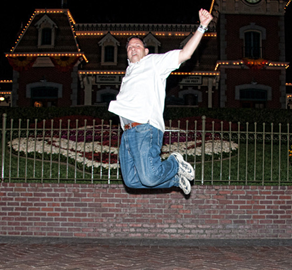
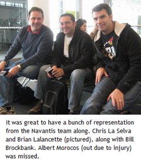
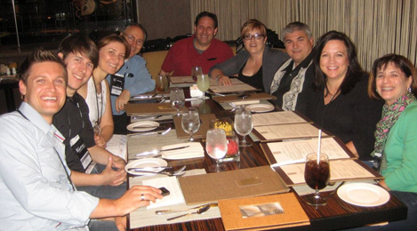
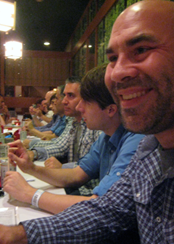
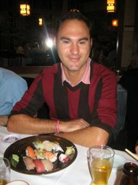

(Thanks to [Marcy Keller](http://www.smugmug.com/gallery/8002079_F8NT99) for the JumpShot at Disney)

I've just returned from the SharePoint Conference in Anaheim. This conference was a great experience, even though there is no way it could live up to the previous conference when SharePoint 2010 was revealed along with all the crazy new metadata capabilities and (one that blew me away), PowerPivot.

Even so, SPC11 was a great "mid-term" networking event, and there was a lot of material from great speakers. Every attendee seems to have had variable experiences. I saw many tweets from highly technical sessions saying things like "finally, THIS is what I came here for". Business focused attendees had some superstar sessions to attend from people like Sue Hanley, Dan Holme, and Scott Jamison, and there were some excellent case studies. But not everyone felt that the conference hit the expected high-notes: [Veronique Palmer](http://veroniquepalmer.wordpress.com/2011/10/10/microsoft-sharepoint-conference-2011-wrap-up-spc11/) was quite disappointed with many sessions and others that I spoke to had various issues.

Here's my take on many of the sessions: _I too was disappointed, not with the content, and not with the presenters, but **with the abstracts**_. The session abstract did not give people enough information to make a rational choice. Microsoft is used to labeling sessions as level 100/200/300/400. And these numbers may work well for purely technical topics. However, SharePoint is a business platform and a large number of attendees were there to learn how to make SharePoint better in a business context. If you look at the session browser, there are many more sessions on topics that are not purely ITPro or Dev, and these needed more fine-grained session information tools to help us choose the sessions that were most applicable to us. (When there are over 240 sessions, and – at the most – you can only attend 16 (assuming you went to no labs or other special functions), hitting the right sessions can make or break your conference experience.

Here's my proposal to Microsoft (obviously, tweaking will be required, but it's a start).

Include a session taxonomy with each abstract:

- **Code**: None/100/200/300/400
- **ITPro**: None/100/200/300/400
- **Capabilities**: Overview/Detailed Out-of-the-box/Drill Down/Deep Dive
- **Branding**: None/Overview/Some/Heavy
- **Tools Used** _(select multiple)_: Web Interface/SPDesigner/Visual Studio/Office/Other

So, an example abstract for an Introduction to the Data View Web Part could potentially look like this:

- **Code**: 100
- **ITPro**: None
- **Capabilities**: Detailed Out-of-the-box
- **Branding**: None
- **Tools Used**: Web Interface + SPDesigner

If I had this information when I was choosing sessions, I would have had a much clearer set of criteria on which to make my choices and I would have been happier with what I saw.

Now, there's one caveat to all this complaining: **All the sessions are available to attendees for download** including sound and screen capture. If you found out that you missed that "can't miss" session, you can download it and watch it at your leisure. (Remember, these will go away after two or three months, so get the ones that you want soon!)

There was so much going on at the conference over and above the scheduled activities. One of my favourites was the SharePoint Salon. (No, not [THAT](http://photo-dict.faqs.org/photofiles/list/4645/6140hair_salon.jpg) type of Salon; [THIS](http://en.wikipedia.org/wiki/Salon_(gathering)) type of Salon). We didn't just chat, but rather had a lively discussion on deep topics. It was a worthwhile event and it was great to see some of my best SharePoint friends again and make some new ones.

Rather than recapping the event, I'll point you to an excellent [write-up by Michelle Strah](http://lifeincapslock.com/sharesalon-and-the-rise-of-ecm-spc11).

In this picture are: (L-to-R) [Michal Pisarek](http://www.linkedin.com/in/michalpisarek), [Richard Harbridge](http://www.linkedin.com/in/rharbridge), [Silvana Nani](http://www.linkedin.com/pub/silvana-nani/5/980/326), [Brian Seitz](http://www.linkedin.com/in/briankseitz), [Me](http://ca.linkedin.com/in/ruvengotz), [Michelle Strah](http://www.linkedin.com/in/drstrah), [Owen Allen](http://www.linkedin.com/in/owenallen), [Jill Kunkel](http://www.linkedin.com/in/jillchappell), and [Susan Hanley](http://www.linkedin.com/in/susanhanley) (Airline/scheduling issues prevented Sarah Hasse and Erica Toelle from being there and they were sadly missed.)

Another fun event that we pre-planned was ShareSushi. We had a good meal, a great time and avoided the food lineups at Disney. It was great to hang with my long-time/long-distance buddy, [Jay O'Hara](http://ca.linkedin.com/pub/jay-o-hara/a/451/230) and to finally meet [Patrick Sledz](http://be.linkedin.com/in/patricksledz) in person. Thanks to Anders Rask and Janis Hall for suggesting and helping to instigate this fun time.

 

I wish I could have stopped time so that I could meet up with everyone I missed and spent more time in the exhibit hall. I can't wait for next year in Las Vegas, when we'll likely get the first look at v.Next.

 

I want to wrap up by thanking Microsoft for putting on an incredible event. Despite some occasional hiccups, given the size and scope of such an undertaking, they did an incredible job of making it all run smoothly
