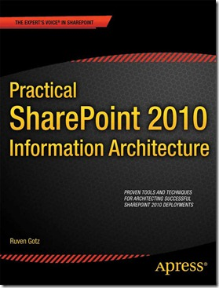

**Update 2: People looking to download the files mentioned in the book can find them here: [http://bit.ly/sps-sample-files](http://bit.ly/sps-sample-files "Sample files from book")**

**Update: To buy this book (Book/Kindle/Other),** **please see the links in the side bar over there** →

If you are responsible for any of the business side of implementing SharePoint, then I think you will find material in this book that will be of value to you. This book captures both tools and approaches that I have found to be successful.

The first chapter talks about some of the soft-skills that you need to cultivate to be a successful business analyst (BA) or information architect (IA).  I then dive into the key tools that really help with engaging the client, getting to shared understanding and shared commitment. These tools include: Mind Manager, Balsamiq, BizAgi, Visio and Compendium.

Topics include: taxonomy, navigation, search, business process, governance, adoption and training.

When I planned this book, I did not want to write a giant reference book that a reader would dip into when researching a particular topic. At only about 250 pages, I hope that people will try to read it all the way through in a just a few days, getting a holistic idea of an approach that can help them to become better practitioners. Most of the tools can be learned very quickly, and they start to provide value right away. I look forward to hearing how people use the book and where it provides value to them.

**_The History of this Book_**

Those of you who have known me for a while have heard me talking about working on a book for over two years, but I wasn’t sure that I could really do it, so I delayed, and wasted time, until finally I decided to do an outline and start a first chapter to see if I could actually string a bunch of words together. It turned out to be good timing, because a few months after that Apress called. They had seen the agenda of a presentation that I was doing and asked if I could do a book about SharePoint, based on my talk. I crossed my fingers and said ‘yes’, and sent them my outline and chapter. That sealed the deal and the process began.

I thought it would be really hard. It was harder than that. Sitting down in the evening after work to try to write 15-20 pages that would make sense and hang together with the rest of the book was really tough. At one point I thought that I would not be able to actually get it done. That’s when I realized that I would need help. So I called in two people who I greatly respect, and whom I am lucky enough to call friends. Sarah Haase has such great experience with building SharePoint solutions that measurably solve business process issues, and she articulates it so well, that I was sure she could help with the chapter on process. Michal Pisarek is one of those rare people who is really strong technically, yet ‘gets’ the business side of SharePoint and understands how to focus on the problem that needs to be solved BEFORE looking at the technology that will solve it. I had been really impressed with some of his writing on search, and so I asked him to contribute the search chapter. With those two chapters off-loaded, I felt like I could possibly see the light at the end of the tunnel.

One of the best parts of being a conference speaker is that I get to learn so much from my colleagues. There is so much in my book that I owe to people that I have learned from along the way. Some of them, like Marcy Kellar, Paul Culmsee, Sadalit van Buren and Erik Swenson have kindly allowed me to use some of their content in the book. Others like Sue Hanley, Virgil Carroll, Richard Harbridge, Christian Buckley, Dux Sy, Michael Sampson, Erica Toelle, Marc Anderson, Eric Riz, and many, many more will probably hear their words echoed in its pages. It’s even possible (though unlikely) that Geoff Varosky and Mark Rackley have had some influence on me.

I am glad to be finally done – and now the next phase of this adventure begins.

**To buy this book (Book/Kindle/Other),** **please see the links at the top of the side bar over there** →

PS. I have a facebook page for the book: [https://www.facebook.com/PracticalSPIA](https://www.facebook.com/PracticalSPIA)
