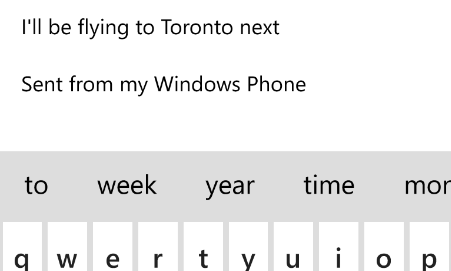

I'm writing this post on the plane, flying home from the SPC12 conference in Las Vegas. When I used "in the trenches" in the title, I mean that particular bit of hell we've all been in: Crammed between the window and a person whom I've never met who likes to order the smelliest sandwich on the cart. In this less than perfect state, I've just spent the past hour cleaning my email inbox using my phone because I just couldn't use my laptop properly with the seat in front of me leaning back.  So I thought I'd let you know how it went.

**Note**: _When I said that I was writing this on the plane, I mean that I composed this post on the phone as well (with the final couple of edits done at home just before posting)._

I found the interface to be smooth and really slick for managing and responding to email. I can select and file individual messages with easy-to-access check boxes. The only thing missing is the ability to add new folders on the fly.

If your folder list is like mine, its fairly long with one layer of nesting. When you select a message and touch the folder icon, the list appears fully expanded, but it scrolls very quickly and easily and, when you go to move another message, the list stays where you left it, which is a very nice UI touch.

The other really smart and useful capability is the predictive text suggestion bar that watches what you type and suggests the next logical words. In the screen shot you can see a message that I am composing. I created this sentence with only 11 keystrokes, while  there are 35 characters on the screen (including "week", which I am just about to click).  I typed the first letter of the first word and the rest of the sentence was built just by clicking the next word offered up, often the first one.  I had to give it the first 3 letters of the word "flying", and two for "Toronto" but all the rest were just there on the bar above the keyboard.

It also learns from what you type. In the first couple of emails, I had to spell out the word "Toronto" almost to the end. But after I did that a couple of times, it moved "Toronto" up in the list, so that I just need to type "To" and it appears.

 

Take a look at [a short video of me using the predictive text feature](http://www.youtube.com/watch?v=gGZZshROnUA&feature=youtu.be "Using the predictive text feature")

I am increasingly pleased with my decision to go with Windows Phone 8 over iPhone. I'd be interested to hear your thoughts.
