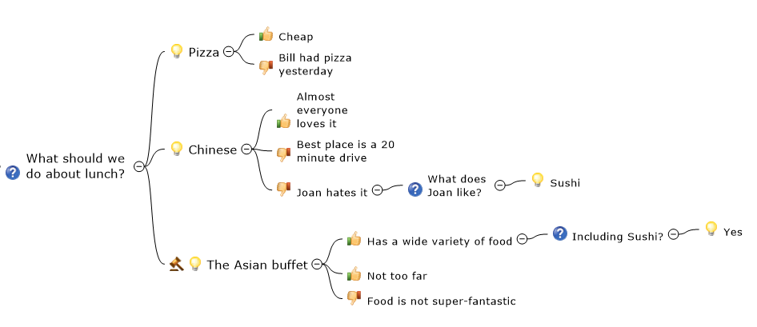
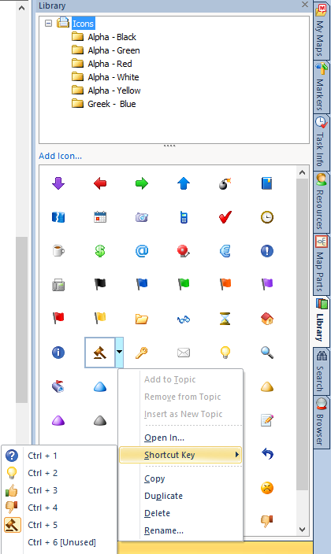
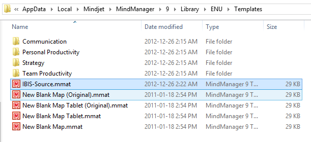

If you don't know what Dialogue Mapping is, you have a bit of reading to do. I'd recommend [Paul Culmsee's excellent series of blog posts](http://www.cleverworkarounds.com/2009/09/10/the-practice-of-dialogue-mapping-part-1/) on the topic. Or, go back to the originator, [Jeff Conklin and his Cognexus Institute](http://www.cognexus.org/id41.htm). But, if you have been using or learning about Dialogue Mapping, you'll know that the standard tool out there for doing it is [Compendium](http://compendium.open.ac.uk/institute/download/download.htm), available for free from the Compendium Institute. Compendium is the tool that everyone uses when they learn to do DM, as did I. However, when I was learning DM, I was already an accomplished user of [MindManager](http://www.mindjet.com/products/mindmanager?lang=en), and there are a number of things that I like about it that are different from Compendium. One of the most important is being able to quickly and efficiently expand and collapse entire subsections of the tree without using transclusion (a DM term).

I have been asked if I would share my templates for doing DM with MindManager, so I've decided to put together this post, linking to my template and instructing you how to get MindManager set up to do Dialogue Mapping.

Here is an example of a very simple Dialogue Map, created in MindManager.

 

The way to configure the icons is to open the icon library, and select the appropriate icon, click the drop-down and select "Shortcut Key". Then select the shortcut to use. It's true that it is a bit awkward to use the Ctrl-1, Ctrl-2, etc. keys to insert the icons, but with a bit of practice, you can get very quick at it.

Fortunately, MindManager comes with pretty good icons for the IBIS grammar.

In case you don't recognize the fifth item, it's a judge's gavel, to indicate a decision.

 

 

 

 

 

 

You can download the template here: [http://bit.ly/IBIS-Template](http://bit.ly/IBIS-Template)

Upload the IBIS template to the path shown below, and give it a try. I'd be interested to hear how you like it.

