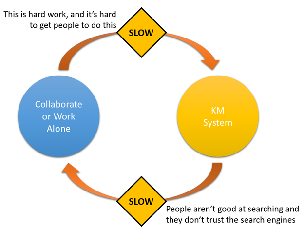
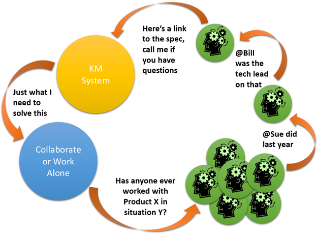

**_Enterprise social networking is not about "Facebook for the enterprise" and it's not about using Twitter and Facebook for communicating with your customers. What it is about is enhancing your knowledge management and collaboration solutions by giving everyone access to the information inside people's heads, no matter where in the world they sit or which department they belong to._**

Social networking in the enterprise has great potential to enhance knowledge management and collaboration systems. But to understand what the true potential is, we need to clarify what we mean when we say "Enterprise Social Networking." In my experience, there is a lot of confusion out there, with some IT executives feeling pressured to implement social tools when they don't see the value.

## What enterprise social is not

It's not about having a corporate Twitter or Facebook account even though these accounts are great for marketing and for supporting and engaging with customers. Your organization should be invested here, gauging customer sentiment and delivering your messages to the world. Typically, it's your marketing or communications groups that manage these accounts.

It's also not about letting your staff tweet or post to Facebook while at work. This is a governance issue that organizations need to address with corporate policies. Many companies actively block access to social media sites to limit on-the-job distractions and potential security issues. However, don't forget that an increasing percentage of your staff has access to these sites via their smartphones, so blocking social networks may not be the solution to the problem.

## The true meaning of enterprise social networking

At its core, enterprise social is about implementing a platform for microblogging that is exclusively available to people within the organization. Microblogging means creating short posts (typically a short paragraph or two, occasionally longer) that can be read by anyone in the company, but which are targeted by keyword or communities of interest. Some executives worry about the idea of running an all-day water-cooler where people waste their time posting inappropriate content. However, in practice this is rarely what happens and it is relatively straightforward to control. If we compare microblogging to email and the telephone, we can see that these are all tools that could easily be abused for time-wasting activities, yet (almost) no-one advocates for their removal at work.

## The value of enterprise social networking

Many companies invest heavily in their Knowledge Management solutions, designing elaborate tagging mechanisms and encouraging the uploading of valuable documents. However, as good as these systems are, the fact is that people are just not that good at searching and it can still be difficult to access just the right piece of information, assuming that procedures have been followed and the documents even make it into the repository.

 

This is where enterprise social can truly shine. A person looking for knowledge on a topic – not just a document, but a specific query about a complex scenario – can ask the question in a space where anyone in the organization can see it and respond. In order to prevent a flood of communication to everyone, there are specific keywords and topic areas that people can subscribe to, and there are whole communities of interest that experts (or non-experts with an interest in that topic) can join. The result is that questions are spread widely through the network.

Now, it's very often the case that the exact right person to answer that question doesn't see it or is not fully engaged in a particular area. However, someone who knows a bit about that topic can spread it more widely, or target a particular person or group to answer the question or to suggest others who may know more.

 

An added bonus of these tools is that the questions and answers aren't stuck (or lost) forever in people's individual email boxes. The conversation threads and links remain visible and can be searched by others who come along later with the same questions.

My argument for the benefits of enterprise social networking comes from my direct experience at Avanade. When I joined a year ago, I wasn't that enthusiastic about enterprise social – I just didn't really see the value. Within two weeks, I was hooked: I saw how it broke down geographical barriers and departmental silos when I started answering questions from people in Australia and getting help from people in Germany. Our social network is now an essential part of my approach to work and problem solving.

 

I hope I have been able to make clear why enterprise social networking should not be confused with more personal social networking in general; it is in fact a powerful way to extend collaboration and tap into the knowledge and experience of your entire organization.

**_A director of HP Labs famously once said, "If only HP knew what HP knows." He was referring to the fact that individuals within HP had knowledge that could provide so much value if only HP as a company could tap into it. Enterprise social networking gives us the opportunity to "know what we know" and leverage that knowledge for the benefit of our employees, our customers and our partners: with careful planning and implementation, it can do the same for you._**
