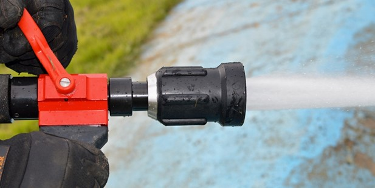

People say to me: How do you find time for yet another source of information? Keeping up with the enterprise social stream (in my case, Yammer) on top of email and Lync messages, not to mention personal social media just seems like too much. It's like drinking from the fire-hose non-stop.

Whenever I hear this, I give out the following bit of advice. When I first joined twitter five or six years ago I had this incredible compulsion to 'keep-up' with the stream. At first, that wasn't too hard. I was only following a few dozen people and, if I was away from my computer for a couple of hours, I could easily scroll back up and catch up with what I'd missed.

As I started to follow more and more people I found I couldn't keep up anymore. So, I made a list called 'hotlist' that had all the people who I really cared to follow on it. I now was back to a manageable stream of information. Well, not exactly manageable. I was still obsessing about scrolling back all the time to make sure that I hadn't missed anything. At one point, it was affecting my work, with me prioritizing catching up over everything else.

I then had an epiphany. The stream is exactly that, a stream of information. You don't drink all the water from the stream, you dip into it from time to time when you have a moment or need some water.

Once I made that realization my life got a lot better. I pictured the twitter stream flowing past whether I was looking at it or not. When I was ready, I would dip into the stream, get as much as I needed and then move on. I was still getting great content, and I made ever smarter use of lists that would let me get the type of information I felt I needed at that point in time.

I have applied that same approach to my enterprise social stream. My email is still a fire hose where I have to look at everything – however briefly – that comes my way. But my Yammer stream is one that I dip into when I can, knowing that if there is something truly urgent, someone will tag me (generating an email) or inform me through another path. You may ask: Aren't you afraid of missing something important? Yes, maybe a little bit. But I have a limited capacity as a human being and time does not expand. I have to come to terms with the fact that I can't keep on top of EVERYthing.

If you are feeling the pressure of information overload, start thinking of your social media streams as if they were streams of water. Dip in when you can and don't worry about the rest which flows past when you're not there.
